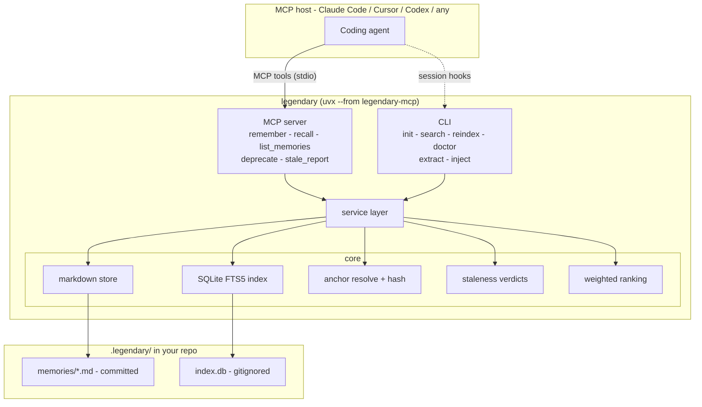
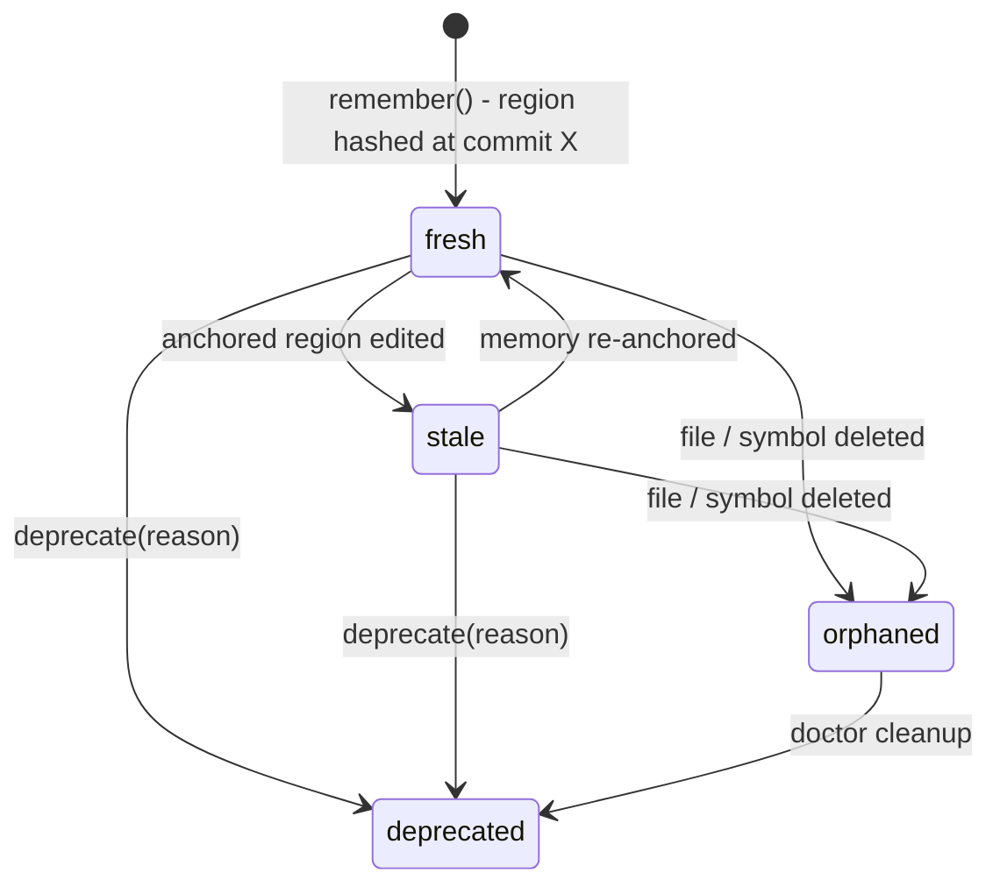

<p align="center">
  
</p>

<p align="center">
  <strong>Code-anchored, staleness-aware, git-native memory for coding agents.</strong>
</p>

<p align="center">
  <a href="https://ashhadahsan.github.io/legendary/"><strong>Documentation</strong></a> &nbsp;·&nbsp;
  <a href="https://ashhadahsan.github.io/legendary/quickstart/">Quickstart</a> &nbsp;·&nbsp;
  <a href="https://ashhadahsan.github.io/legendary/concepts/">Concepts</a> &nbsp;·&nbsp;
  <a href="https://ashhadahsan.github.io/legendary/tools/">MCP tools</a> &nbsp;·&nbsp;
  <a href="https://ashhadahsan.github.io/legendary/comparison/">Comparison</a>
</p>

<p align="center">
  <a href="https://github.com/ashhadahsan/legendary/actions/workflows/ci.yml"></a>
  <a href="https://pypi.org/project/legendary-mcp/"></a>
  <a href="https://pypi.org/project/legendary-mcp/"></a>
  <a href="https://ashhadahsan.github.io/legendary/"></a>
  <a href="LICENSE"></a>
</p>

---

Coding agents are stateless: every session re-reads your repo, re-derives old
decisions, and repeats debugging attempts that already failed. Memory
frameworks remember conversations but are code-blind - a memory never knows it
was about `src/sync/worker.py:120` and never notices when that code changes.

legendary merges the two sides:

- **Anchored** - memories link to a file / symbol / line range at a commit
- **Staleness-aware** - when the anchored code changes, recall flags the
  memory `stale`; when it disappears, `orphaned`
- **Typed** - `decision` (why it is this way), `episode` (tried X, failed
  because Y), `convention`, `reference`
- **Git-native** - memories are markdown files in `.legendary/memories/`,
  committed with your code, diffable in PRs, shared with your whole team
- **Local-first** - no cloud, no accounts, no API keys, no embeddings;
  SQLite FTS5 does search

## The 30-second demo

```console
$ legendary recall "strip None"
strip() breaks on None   [fresh]

$ vim app.py     # edit the anchored function

$ legendary recall "strip None"
strip() breaks on None   [stale - parse changed since 8fa2c31]
```

That flag is the whole point. Every other memory system would still serve you
that memory with full confidence.

## Quick start

```bash
cd your-repo
uvx --from legendary-mcp legendary init   # scaffolds .legendary/, prints MCP + hook setup
```

Add the printed MCP snippet to your client (Claude Code, Cursor, any MCP
host). Your agent now has five tools:

| Tool | Purpose |
|---|---|
| `remember` | save a memory anchored to code |
| `recall` | search; results carry fresh/stale/orphaned flags |
| `list_memories` | browse by type/tag/file |
| `deprecate` | soft-delete with a reason |
| `stale_report` | all memories whose code moved on |

Optional auto-capture (Claude Code): the printed hooks run
`legendary inject` at session start (context injection) and
`legendary extract` at session end (LLM pass over the transcript, saved with
`source: auto-extract` provenance).

## CLI

`legendary init | search <q> | reindex | doctor | extract [transcript] | inject | mcp`

`legendary mcp` serves stdio by default; `--transport http` serves stateless
streamable HTTP for containers and shared team deployments.

## Recall quality

Search uses SQLite FTS5 with Porter stemming, so an agent asking about
`deadlock` finds a memory that says "deadlocked", and `transactions` finds
"transaction" - word-form drift between how you ask and how it was written
doesn't lose the memory. Ranking combines text relevance, overlap with the
files you're editing, recency, and a penalty for staleness.

## How staleness works

At write time each anchor stores a normalized content hash of the anchored
region (symbol body, line range, or file). At recall time the region is
re-resolved (symbols may move) and re-hashed. Changed hash => `stale`;
missing file/region => `orphaned`. Stale memories still surface - the *why*
often survives a refactor - but ranked lower and clearly flagged.

Whitespace-only changes do not invalidate a memory, and a symbol that merely
moves down the file stays `fresh`, because anchors are re-resolved by symbol
before hashing.

## Architecture





## What a memory looks like

```markdown
---
id: mem-a1b2c3d4
type: episode
title: Retry logic in sync worker breaks under SQLite WAL
created: 2026-08-14T15:30:00Z
source: agent
status: active
anchors:
  - file: src/sync/worker.py
    symbol: SyncWorker.run
    lines: [120, 164]
    commit: 8fa2c31
    content_hash: sha256:9f8e...
tags: [sqlite, concurrency]
---
Tried wrapping retries in a transaction (attempt 1) - deadlocks under WAL.
Working approach: PRAGMA busy_timeout.
```

Human-readable, PR-reviewable, and it merges like code.

## Benchmark: retracted

An earlier n=5 run reported that legendary cost more than no memory at all. **That
result has been withdrawn** - the fixture let session 2 recover the answer by
reading the file session 1 had already fixed, and the headline metric matched
strings present in the fixture's own source. It measured nothing.

The raw data and a full account of the three defects are published at
[benchmark](https://ashhadahsan.github.io/legendary/benchmark/). This project
makes **no performance claim** until a valid benchmark exists.

## How this differs from other tools

| | Graphify / Serena | mem0 / Zep | legendary |
|---|---|---|---|
| Models code structure | yes | no | anchors only |
| Remembers decisions | no | yes | yes |
| Remembers failed attempts | no | partly | yes (`episode`) |
| Memories tied to code entities | n/a | no | yes |
| Detects when a memory goes stale | n/a | no | yes |
| Team-shared via git | graph committed | no (service) | yes |
| Retrieval needs an LLM | no | embeddings | no |

Code-graph tools answer "what is this code?"; legendary answers "what do we
already know about it, and is that still true?" Running both is a good setup.

## Documentation

Full docs at **[ashhadahsan.github.io/legendary](https://ashhadahsan.github.io/legendary/)** —
[quickstart](https://ashhadahsan.github.io/legendary/quickstart/),
[concepts](https://ashhadahsan.github.io/legendary/concepts/),
[MCP tool reference](https://ashhadahsan.github.io/legendary/tools/),
[CLI reference](https://ashhadahsan.github.io/legendary/cli/),
[benchmark](https://ashhadahsan.github.io/legendary/benchmark/), and
[FAQ](https://ashhadahsan.github.io/legendary/faq/).

Contributing? See [CONTRIBUTING.md](CONTRIBUTING.md).

## License

MIT
