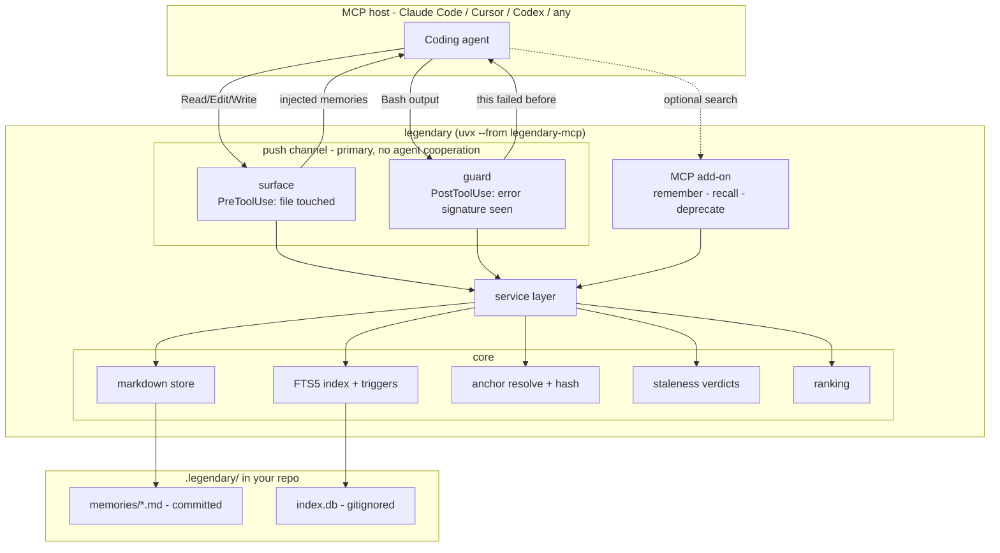
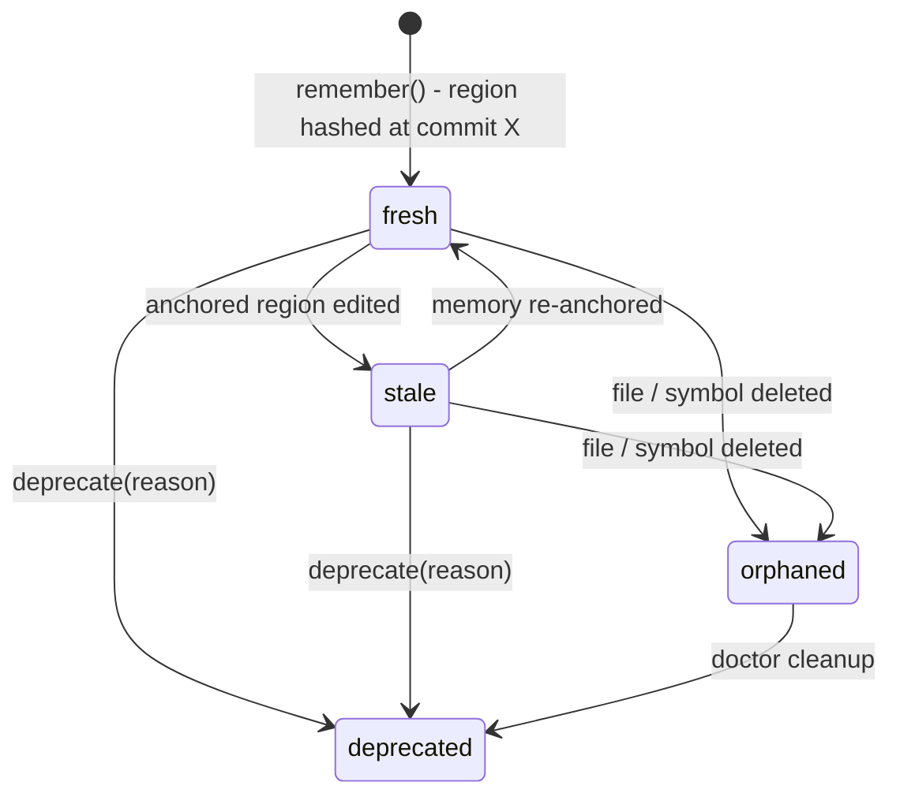

<p align="center">
  
</p>

<p align="center">
  <strong>Code-anchored, staleness-aware, git-native memory for coding agents.</strong>
</p>

<p align="center">
  <a href="https://ashhadahsan.github.io/legendary/"><strong>Documentation</strong></a> &nbsp;·&nbsp;
  <a href="https://ashhadahsan.github.io/legendary/quickstart/">Quickstart</a> &nbsp;·&nbsp;
  <a href="https://ashhadahsan.github.io/legendary/concepts/">Concepts</a> &nbsp;·&nbsp;
  <a href="https://ashhadahsan.github.io/legendary/tools/">MCP tools</a> &nbsp;·&nbsp;
  <a href="https://ashhadahsan.github.io/legendary/comparison/">Comparison</a>
</p>

<p align="center">
  <a href="https://github.com/ashhadahsan/legendary/actions/workflows/ci.yml"></a>
  <a href="https://pypi.org/project/legendary-mcp/"></a>
  <a href="https://pypi.org/project/legendary-mcp/"></a>
  <a href="https://ashhadahsan.github.io/legendary/"></a>
  <a href="LICENSE"></a>
</p>

---

**Your coding agent keeps solving the same problem twice. legendary makes it
stop — and tells you when its notes have gone stale.**

Watch it interrupt a repeat mistake, unprompted — then downgrade its own advice
when the code moves on:

<p align="center">
  
</p>

No `recall` call. No query. **That stale flag is the part nobody else has** —
every other memory tool keeps asserting a claim that stopped being true weeks
ago.

```bash
uvx --from legendary-mcp legendary init
```

Four dependencies. No cloud, no API keys, no vector database, no LLM in the
loop. Memories are markdown in your repo — committed, reviewed in PRs, shared
with your team.

## Quick start

```bash
cd your-repo
uvx --from legendary-mcp legendary init   # scaffolds .legendary/, prints MCP + hook setup
```

`init` installs the hooks for you — that is the primary channel, and it needs
no agent cooperation:

| Hook | Fires when | Delivers |
|---|---|---|
| `PreToolUse` | agent reads/edits a file | memories anchored to that file |
| `PostToolUse` | a Bash result contains a stored error signature | the episode that recorded that failure |

Optionally, paste the printed MCP snippet for agent-initiated search. Three
tools: `remember`, `recall`, `deprecate`.

## How memories reach the agent

Two push channels, both installed by `init`:

**File-touch** (`surface`) — the agent opens `sync/worker.py`, and any memory
anchored there is injected before the tool call completes.

**Error-signature** (`guard`) — every `episode` stores the verbatim error
strings that produced it. When one reappears in a command's output, that
episode is pushed back. This is why episodes *require* triggers: an agent acts
on retrieved experience when the current situation resembles the recorded one,
and a recurring error message is the strongest resemblance signal there is.

Both dedupe per session, and both render imperatively — `(verified against
current code)` when the anchor still hashes, `[stale - ... verify before
trusting]` when it does not.

## CLI

`legendary init | search <q> | reindex | doctor | surface | guard | mcp`

## Recall quality

Search uses SQLite FTS5 with Porter stemming, so an agent asking about
`deadlock` finds a memory that says "deadlocked". Ranking is text relevance
plus overlap with the files you're editing, minus a staleness penalty — fixed
weights, no tuning. Recency is deliberately absent: a memory whose anchor still
hashes fresh has *survived*, and penalizing it for age would double-count what
staleness already measures.

## This repo uses it

`legendary` records its own mistakes. Real memories from building it, anchored
to the code they came from:

```console
$ legendary search "why did the benchmark arms run the wrong config"
[fresh] benchmark arms silently ran the wrong configuration three times
        anchored: bench/run_bench.py
```

Browse them in [`.legendary/memories/`](.legendary/memories/) — they are
markdown, committed, and reviewed like any other file.

## How staleness works

At write time each anchor stores a normalized content hash of the anchored
region (symbol body, line range, or file). At recall time the region is
re-resolved (symbols may move) and re-hashed. Changed hash => `stale`;
missing file/region => `orphaned`. Stale memories still surface - the *why*
often survives a refactor - but ranked lower and clearly flagged.

Whitespace-only changes do not invalidate a memory, and a symbol that merely
moves down the file stays `fresh`, because anchors are re-resolved by symbol
before hashing.

## Architecture





## What a memory looks like

```markdown
---
id: mem-a1b2c3d4
type: episode
title: Retry logic in sync worker breaks under SQLite WAL
created: 2026-08-14T15:30:00Z
source: agent
status: active
anchors:
  - file: src/sync/worker.py
    symbol: SyncWorker.run
    lines: [120, 164]
    commit: 8fa2c31
    content_hash: sha256:9f8e...
tags: [sqlite, concurrency]
triggers:
  - "sqlite3.OperationalError: database is locked"
---
Tried wrapping retries in a deferred transaction - SQLITE_BUSY on lock upgrade,
and busy_timeout cannot help. Working approach: BEGIN IMMEDIATE.
```

Human-readable, PR-reviewable, and it merges like code.

## Benchmark

On a task where the needed knowledge **cannot be recovered from the repository**
— it lives in an opaque service, and the working tree is hard-reset between
sessions — n=10 per arm:


| | median rediscoveries in session 2 |
|---|---|
| no memory | 9.5 |
| mem0 | 11.5 |
| **legendary** | **1.0** |

**p = 0.007** vs mem0 (exact permutation test). mem0 was indistinguishable from
having no memory at all on this task (p = 0.695).

**Where it does not help:** on a second scenario where the needed knowledge was
already in the model's priors, legendary made no difference and cost **54%
more**. It pays off on arbitrary, environment-specific knowledge — the kind with
no home in a comment — and is overhead otherwise.

Full methodology, every raw trial, the scenarios where it loses, and the
results we retracted along the way:
[benchmark](https://ashhadahsan.github.io/legendary/benchmark/).

## How this differs from other tools

| | Graphify / Serena | mem0 / Zep | legendary |
|---|---|---|---|
| Models code structure | yes | no | anchors only |
| Remembers decisions | no | yes | yes |
| Remembers failed attempts | no | partly | yes (`episode` + triggers) |
| Memories tied to code entities | n/a | no | yes |
| Detects when a memory goes stale | n/a | no | yes |
| Team-shared via git | graph committed | no (service) | yes |
| Retrieval needs an LLM | no | embeddings | no |
| Pushes memory without being asked | no | no | yes (hooks) |

Code-graph tools answer "what is this code?"; legendary answers "what do we
already know about it, and is that still true?" Running both is a good setup.

## Documentation

Full docs at **[ashhadahsan.github.io/legendary](https://ashhadahsan.github.io/legendary/)** —
[quickstart](https://ashhadahsan.github.io/legendary/quickstart/),
[concepts](https://ashhadahsan.github.io/legendary/concepts/),
[MCP tool reference](https://ashhadahsan.github.io/legendary/tools/),
[CLI reference](https://ashhadahsan.github.io/legendary/cli/),
[benchmark](https://ashhadahsan.github.io/legendary/benchmark/), and
[FAQ](https://ashhadahsan.github.io/legendary/faq/).

Contributing? See [CONTRIBUTING.md](CONTRIBUTING.md).
Release history: [CHANGELOG.md](CHANGELOG.md).

## License

MIT
