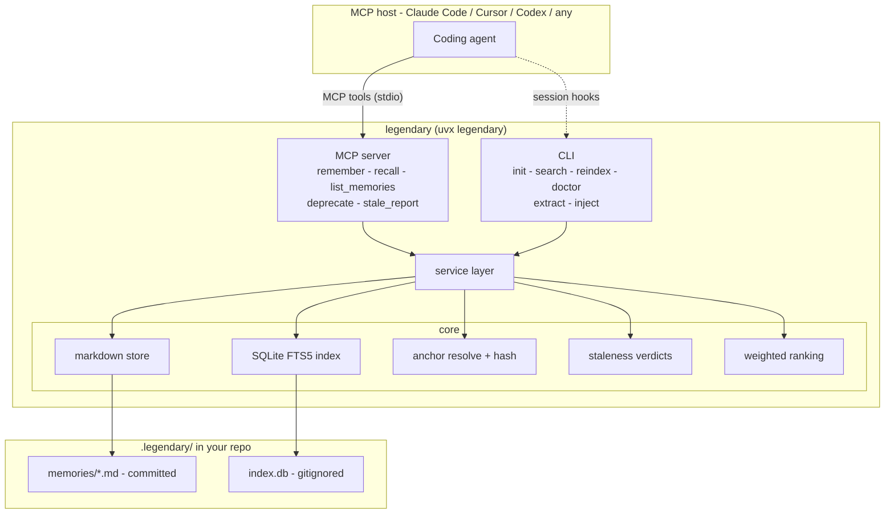
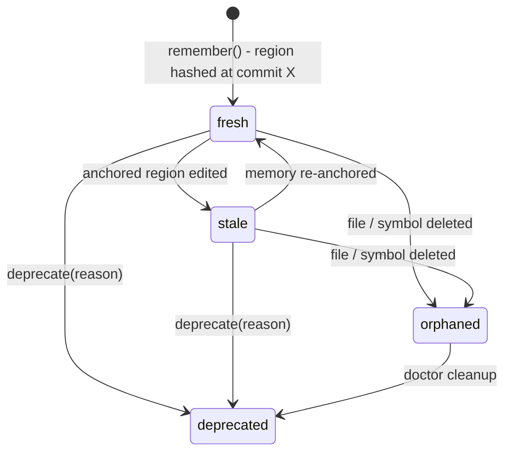

# Legendary v1 Implementation Plan

> **For agentic workers:** REQUIRED SUB-SKILL: Use superpowers:subagent-driven-development (recommended) or superpowers:executing-plans to implement this plan task-by-task. Steps use checkbox (`- [ ]`) syntax for tracking.

**Goal:** Build legendary v1 — a local-first MCP server + CLI that gives coding agents code-anchored, staleness-aware, git-native memory.

**Architecture:** Canonical store is one frontmatter-markdown file per memory in `.legendary/memories/` inside the *target* repo; a derived SQLite FTS5 index (`.legendary/index.db`, gitignored) serves search. Anchors bind memories to `{file, symbol?, lines?, commit, content_hash}`; staleness is computed at recall time by re-resolving and re-hashing the anchored region. An MCP server (FastMCP) and a CLI both call a shared `service.py` layer.

**Tech Stack:** Python 3.12, uv, pydantic v2, PyYAML, `mcp` SDK (FastMCP), `tree-sitter-language-pack` (symbol resolution for py/js/ts), stdlib `sqlite3` + FTS5, stdlib `argparse`, pytest.

**Spec:** `docs/superpowers/specs/2026-08-14-legendary-code-anchored-memory-design.md`

**Commit style:** plain messages, NO Co-Authored-By or AI-attribution trailers, ever.

---

## File structure

```
pyproject.toml                 # uv project, deps, entry point `legendary`
src/legendary/__init__.py      # version
src/legendary/models.py        # Anchor, Memory pydantic models + (de)serialization helpers
src/legendary/store.py         # markdown store: save/load/list/paths
src/legendary/anchor.py        # region resolution (symbol/lines/file), normalization, hashing
src/legendary/stale.py         # fresh/stale/orphaned verdicts
src/legendary/index.py         # SQLite FTS5 build/rebuild/search
src/legendary/rank.py          # score + recall ranking
src/legendary/service.py       # remember/recall/list/deprecate/stale_report (used by MCP + CLI)
src/legendary/extract.py       # transcript -> memory candidates via `claude -p`
src/legendary/mcp_server.py    # FastMCP tool wrappers around service
src/legendary/cli.py           # init/search/reindex/doctor/extract/inject/mcp
tests/conftest.py              # temp git-repo fixture
tests/test_models.py
tests/test_store.py
tests/test_anchor.py
tests/test_stale.py
tests/test_index.py
tests/test_rank.py
tests/test_service.py
tests/test_extract.py
tests/test_mcp_server.py
tests/test_cli.py
```

All modules take an explicit `repo_root: Path` — no global state. `.legendary/` always lives at `repo_root/.legendary/`.

---

### Task 1: Project scaffold

**Files:**
- Create: `pyproject.toml`, `src/legendary/__init__.py`, `.gitignore`, `tests/__init__.py` (empty)

- [ ] **Step 1: Create pyproject.toml**

```toml
[project]
name = "legendary"
version = "0.1.0"
description = "Code-anchored, staleness-aware, git-native memory for coding agents"
requires-python = ">=3.12"
license = { text = "MIT" }
dependencies = [
    "pydantic>=2.7",
    "pyyaml>=6.0",
    "mcp>=2.0",
    "tree-sitter-language-pack>=0.7",
]

[project.scripts]
legendary = "legendary.cli:main"

[dependency-groups]
dev = ["pytest>=8.0"]

[build-system]
requires = ["hatchling"]
build-backend = "hatchling.build"

[tool.hatch.build.targets.wheel]
packages = ["src/legendary"]

[tool.pytest.ini_options]
testpaths = ["tests"]
```

- [ ] **Step 2: Create src/legendary/__init__.py**

```python
__version__ = "0.1.0"
```

- [ ] **Step 3: Create .gitignore**

```
.venv/
__pycache__/
*.egg-info/
dist/
.pytest_cache/
```

- [ ] **Step 4: Verify environment**

Run: `uv sync && uv run pytest --version`
Expected: a pytest 8+ version prints (9.x resolves today); exit 0. (No tests yet — `uv run pytest` would exit 5 "no tests collected", that's fine.)

Also confirm the MCP major version is the one this plan targets:

Run: `uv run python -c "from mcp.server.mcpserver import MCPServer; print('mcp 2.x ok')"`
Expected: `mcp 2.x ok`. If this raises ImportError, the resolver picked mcp 1.x — Task 9 targets the 2.0 API (`mcp.server.mcpserver`), NOT the 1.x `mcp.server.fastmcp`.

- [ ] **Step 5: Commit**

```bash
git add pyproject.toml src/legendary/__init__.py .gitignore uv.lock
git commit -m "chore: scaffold legendary python project"
```

---

### Task 2: Models — Anchor + Memory with markdown round-trip

**Files:**
- Create: `src/legendary/models.py`
- Test: `tests/test_models.py`

- [ ] **Step 1: Write the failing tests**

```python
# tests/test_models.py
from datetime import datetime, timezone

from legendary.models import Anchor, Memory


def make_memory() -> Memory:
    return Memory(
        id="mem-a1b2c3d4",
        type="episode",
        title="Retry logic breaks under WAL",
        body="Tried transactions (attempt 1) - deadlocks under WAL.\n\nWorking approach: busy_timeout.",
        created=datetime(2026, 8, 14, 15, 30, tzinfo=timezone.utc),
        source="agent",
        status="active",
        anchors=[
            Anchor(
                file="src/sync/worker.py",
                symbol="SyncWorker.run",
                lines=(120, 164),
                commit="8fa2c31",
                content_hash="sha256:9f8e",
            )
        ],
        tags=["sqlite", "concurrency"],
    )


def test_markdown_round_trip():
    mem = make_memory()
    text = mem.to_markdown()
    loaded = Memory.from_markdown(text)
    assert loaded == mem


def test_markdown_has_frontmatter_and_body():
    text = make_memory().to_markdown()
    assert text.startswith("---\n")
    assert "Working approach: busy_timeout." in text
    assert "id: mem-a1b2c3d4" in text


def test_new_id_is_deterministic():
    created = datetime(2026, 8, 14, tzinfo=timezone.utc)
    a = Memory.new_id("some title", created)
    b = Memory.new_id("some title", created)
    c = Memory.new_id("other title", created)
    assert a == b
    assert a != c
    assert a.startswith("mem-") and len(a) == 4 + 8


def test_defaults():
    mem = Memory(
        id="mem-x",
        type="decision",
        title="t",
        body="b",
        created=datetime(2026, 8, 14, tzinfo=timezone.utc),
    )
    assert mem.source == "agent"
    assert mem.status == "active"
    assert mem.anchors == []
    assert mem.tags == []
    assert mem.deprecated_reason is None
```

- [ ] **Step 2: Run tests to verify they fail**

Run: `uv run pytest tests/test_models.py -v`
Expected: FAIL — `ModuleNotFoundError: No module named 'legendary.models'`

- [ ] **Step 3: Implement models.py**

```python
# src/legendary/models.py
"""Core data models: Anchor and Memory, with markdown (de)serialization."""
from __future__ import annotations

import hashlib
from datetime import datetime
from typing import Literal, Optional

import yaml
from pydantic import BaseModel, Field

MemoryType = Literal["decision", "episode", "convention", "reference"]
MemorySource = Literal["agent", "auto-extract", "human"]
MemoryStatus = Literal["active", "deprecated"]

FRONTMATTER_SEP = "---"


class Anchor(BaseModel):
    file: str
    symbol: Optional[str] = None
    lines: Optional[tuple[int, int]] = None  # 1-based inclusive
    commit: Optional[str] = None
    content_hash: Optional[str] = None


class Memory(BaseModel):
    id: str
    type: MemoryType
    title: str
    body: str
    created: datetime
    source: MemorySource = "agent"
    status: MemoryStatus = "active"
    deprecated_reason: Optional[str] = None
    anchors: list[Anchor] = Field(default_factory=list)
    tags: list[str] = Field(default_factory=list)

    @staticmethod
    def new_id(title: str, created: datetime) -> str:
        digest = hashlib.sha256(f"{title}{created.isoformat()}".encode()).hexdigest()
        return f"mem-{digest[:8]}"

    def to_markdown(self) -> str:
        meta = self.model_dump(exclude={"body"}, exclude_none=True, mode="json")
        front = yaml.safe_dump(meta, sort_keys=False, allow_unicode=True).strip()
        return f"{FRONTMATTER_SEP}\n{front}\n{FRONTMATTER_SEP}\n{self.body}\n"

    @classmethod
    def from_markdown(cls, text: str) -> "Memory":
        parts = text.split(f"{FRONTMATTER_SEP}\n", 2)
        if len(parts) < 3 or parts[0].strip():
            raise ValueError("not a frontmatter markdown memory")
        meta = yaml.safe_load(parts[1])
        body = parts[2].rstrip("\n")
        return cls(body=body, **meta)
```

- [ ] **Step 4: Run tests to verify they pass**

Run: `uv run pytest tests/test_models.py -v`
Expected: 4 passed

- [ ] **Step 5: Commit**

```bash
git add src/legendary/models.py tests/test_models.py tests/__init__.py
git commit -m "feat: Anchor and Memory models with markdown round-trip"
```

---

### Task 3: Store — canonical markdown files

**Files:**
- Create: `src/legendary/store.py`, `tests/conftest.py`
- Test: `tests/test_store.py`

- [ ] **Step 1: Write the shared git-repo fixture**

```python
# tests/conftest.py
import subprocess
from pathlib import Path

import pytest

SAMPLE_PY = '''\
class SyncWorker:
    """Worker that syncs things."""

    def run(self, retries: int = 3) -> None:
        for attempt in range(retries):
            self._sync_once()

    def _sync_once(self) -> None:
        pass


def helper(x: int) -> int:
    return x + 1
'''


def _git(repo: Path, *args: str) -> str:
    out = subprocess.run(
        ["git", *args], cwd=repo, capture_output=True, text=True, check=True
    )
    return out.stdout.strip()


@pytest.fixture
def repo(tmp_path: Path) -> Path:
    """A temp git repo with one committed python file at src/sync/worker.py."""
    _git(tmp_path, "init", "-b", "main")
    _git(tmp_path, "config", "user.email", "t@t.t")
    _git(tmp_path, "config", "user.name", "t")
    src = tmp_path / "src" / "sync"
    src.mkdir(parents=True)
    (src / "worker.py").write_text(SAMPLE_PY)
    _git(tmp_path, "add", "-A")
    _git(tmp_path, "commit", "-m", "initial")
    return tmp_path
```

- [ ] **Step 2: Write the failing tests**

```python
# tests/test_store.py
from datetime import datetime, timezone
from pathlib import Path

from legendary.models import Memory
from legendary.store import delete, load, load_all, memories_dir, save


def mem(i: str = "mem-00000001", title: str = "t") -> Memory:
    return Memory(
        id=i, type="decision", title=title, body="body",
        created=datetime(2026, 8, 14, tzinfo=timezone.utc),
    )


def test_save_creates_markdown_file(repo: Path):
    save(repo, mem())
    path = memories_dir(repo) / "mem-00000001.md"
    assert path.exists()
    assert "id: mem-00000001" in path.read_text()


def test_save_then_load_round_trips(repo: Path):
    m = mem()
    save(repo, m)
    assert load(repo, m.id) == m


def test_load_all_skips_malformed_files(repo: Path):
    save(repo, mem("mem-00000001", "one"))
    save(repo, mem("mem-00000002", "two"))
    (memories_dir(repo) / "broken.md").write_text("not a memory at all")
    loaded = load_all(repo)
    assert sorted(m.id for m in loaded) == ["mem-00000001", "mem-00000002"]


def test_load_missing_returns_none(repo: Path):
    assert load(repo, "mem-nope") is None


def test_delete(repo: Path):
    m = mem()
    save(repo, m)
    delete(repo, m.id)
    assert load(repo, m.id) is None
```

- [ ] **Step 3: Run tests to verify they fail**

Run: `uv run pytest tests/test_store.py -v`
Expected: FAIL — `ModuleNotFoundError: No module named 'legendary.store'`

- [ ] **Step 4: Implement store.py**

```python
# src/legendary/store.py
"""Canonical markdown store under <repo>/.legendary/memories/."""
from __future__ import annotations

import sys
from pathlib import Path
from typing import Optional

from legendary.models import Memory


def legendary_dir(repo_root: Path) -> Path:
    return repo_root / ".legendary"


def memories_dir(repo_root: Path) -> Path:
    return legendary_dir(repo_root) / "memories"


def _path(repo_root: Path, memory_id: str) -> Path:
    return memories_dir(repo_root) / f"{memory_id}.md"


def save(repo_root: Path, memory: Memory) -> Path:
    d = memories_dir(repo_root)
    d.mkdir(parents=True, exist_ok=True)
    path = _path(repo_root, memory.id)
    path.write_text(memory.to_markdown())
    return path


def load(repo_root: Path, memory_id: str) -> Optional[Memory]:
    path = _path(repo_root, memory_id)
    if not path.exists():
        return None
    return Memory.from_markdown(path.read_text())


def load_all(repo_root: Path) -> list[Memory]:
    d = memories_dir(repo_root)
    if not d.exists():
        return []
    out: list[Memory] = []
    for path in sorted(d.glob("*.md")):
        try:
            out.append(Memory.from_markdown(path.read_text()))
        except Exception as exc:  # malformed file: warn, never crash recall
            print(f"legendary: skipping malformed {path.name}: {exc}", file=sys.stderr)
    return out


def delete(repo_root: Path, memory_id: str) -> None:
    _path(repo_root, memory_id).unlink(missing_ok=True)
```

- [ ] **Step 5: Run tests to verify they pass**

Run: `uv run pytest tests/test_store.py -v`
Expected: 5 passed

- [ ] **Step 6: Commit**

```bash
git add src/legendary/store.py tests/test_store.py tests/conftest.py
git commit -m "feat: markdown memory store with graceful malformed-file handling"
```

---

### Task 4: Anchoring — region resolution, normalization, hashing

**Files:**
- Create: `src/legendary/anchor.py`
- Test: `tests/test_anchor.py`

- [ ] **Step 1: Write the failing tests**

```python
# tests/test_anchor.py
from pathlib import Path

import pytest

from legendary.anchor import (
    hash_text,
    normalize,
    region_text,
    resolve_and_hash,
)
from legendary.models import Anchor


def test_normalize_strips_whitespace_noise():
    a = "def f():\n    return 1\n"
    b = "def f():\n        return 1\n\n"
    assert normalize(a) == normalize(b)


def test_hash_text_is_stable_and_prefixed():
    h = hash_text("hello")
    assert h.startswith("sha256:")
    assert h == hash_text("hello")


def test_region_text_symbol_python_method(repo: Path):
    anchor = Anchor(file="src/sync/worker.py", symbol="SyncWorker.run")
    text, lines = region_text(repo, anchor)
    assert "def run(self" in text
    assert "_sync_once" in text
    assert "def helper" not in text
    assert lines[0] >= 1 and lines[1] > lines[0]


def test_region_text_symbol_top_level_function(repo: Path):
    text, _ = region_text(repo, Anchor(file="src/sync/worker.py", symbol="helper"))
    assert text.startswith("def helper")


def test_region_text_lines(repo: Path):
    text, lines = region_text(repo, Anchor(file="src/sync/worker.py", lines=(1, 2)))
    assert "class SyncWorker" in text
    assert lines == (1, 2)


def test_region_text_whole_file(repo: Path):
    text, _ = region_text(repo, Anchor(file="src/sync/worker.py"))
    assert "class SyncWorker" in text and "def helper" in text


def test_region_text_missing_file_returns_none(repo: Path):
    assert region_text(repo, Anchor(file="nope.py")) is None


def test_region_text_unresolvable_symbol_falls_back_to_file(repo: Path):
    anchor = Anchor(file="src/sync/worker.py", symbol="DoesNotExist")
    text, _ = region_text(repo, anchor)
    assert "class SyncWorker" in text  # whole-file fallback


def test_resolve_and_hash_fills_fields(repo: Path):
    anchor = resolve_and_hash(repo, Anchor(file="src/sync/worker.py", symbol="SyncWorker.run"))
    assert anchor.content_hash and anchor.content_hash.startswith("sha256:")
    assert anchor.commit and len(anchor.commit) >= 7
    assert anchor.lines is not None  # resolved span recorded for fallback


def test_resolve_and_hash_missing_file_raises(repo: Path):
    with pytest.raises(FileNotFoundError):
        resolve_and_hash(repo, Anchor(file="nope.py"))


def test_resolve_and_hash_unresolvable_symbol_raises(repo: Path):
    # write path is strict (spec 3.2) even though region_text is lenient
    with pytest.raises(ValueError, match="line range"):
        resolve_and_hash(repo, Anchor(file="src/sync/worker.py", symbol="DoesNotExist"))


def test_region_text_out_of_range_lines_fall_back_to_file(repo: Path):
    # file shrank below the stored range -> whole file, NOT None
    text, _ = region_text(repo, Anchor(file="src/sync/worker.py", lines=(900, 950)))
    assert "class SyncWorker" in text
```

- [ ] **Step 2: Run tests to verify they fail**

Run: `uv run pytest tests/test_anchor.py -v`
Expected: FAIL — `ModuleNotFoundError: No module named 'legendary.anchor'`

- [ ] **Step 3: Implement anchor.py**

```python
# src/legendary/anchor.py
"""Resolve an Anchor to source text, normalize it, and hash it."""
from __future__ import annotations

import hashlib
import subprocess
from pathlib import Path
from typing import Optional

from legendary.models import Anchor

# file suffix -> tree-sitter language name
_LANGS = {
    ".py": "python",
    ".js": "javascript",
    ".jsx": "javascript",
    ".ts": "typescript",
    ".tsx": "tsx",
}
_DEF_TYPES = {
    "python": {"function_definition", "class_definition"},
    "javascript": {"function_declaration", "class_declaration", "method_definition"},
    "typescript": {"function_declaration", "class_declaration", "method_definition"},
    "tsx": {"function_declaration", "class_declaration", "method_definition"},
}


def normalize(text: str) -> str:
    """Whitespace-insensitive form: strip each line, drop blank lines."""
    return "\n".join(line.strip() for line in text.splitlines() if line.strip())


def hash_text(text: str) -> str:
    return "sha256:" + hashlib.sha256(normalize(text).encode()).hexdigest()


def _find_def(node, name: str, def_types: set[str]):
    for child in node.children:
        if child.type in def_types:
            n = child.child_by_field_name("name")
            if n is not None and n.text.decode() == name:
                return child
        found = _find_def(child, name, def_types)
        if found is not None:
            return found
    return None


def _symbol_span(path: Path, symbol: str) -> Optional[tuple[int, int]]:
    """Return 1-based inclusive (start, end) lines of a possibly dotted symbol."""
    lang = _LANGS.get(path.suffix)
    if lang is None:
        return None
    try:
        from tree_sitter_language_pack import get_parser
        parser = get_parser(lang)
    except Exception:
        return None
    tree = parser.parse(path.read_bytes())
    scope = tree.root_node
    for part in symbol.split("."):
        scope = _find_def(scope, part, _DEF_TYPES[lang])
        if scope is None:
            return None
    return (scope.start_point[0] + 1, scope.end_point[0] + 1)


def region_text(repo_root: Path, anchor: Anchor) -> Optional[tuple[str, tuple[int, int]]]:
    """Resolve anchor to (text, (start_line, end_line)). None if file is gone.

    Resolution order: symbol -> lines -> whole file. An unresolvable symbol
    falls back to lines (if present) then whole file.
    """
    path = repo_root / anchor.file
    if not path.is_file():
        return None
    all_lines = path.read_text(errors="replace").splitlines()

    if anchor.symbol:
        span = _symbol_span(path, anchor.symbol)
        if span is not None:
            s, e = span
            return "\n".join(all_lines[s - 1 : e]), (s, e)
    if anchor.lines:
        s, e = anchor.lines
        s = max(1, s)
        e = min(len(all_lines), e)
        # If the range clamps to empty (the file shrank), fall through to the
        # whole-file branch. None is reserved strictly for a missing file.
        if s <= e:
            return "\n".join(all_lines[s - 1 : e]), (s, e)
    return "\n".join(all_lines), (1, max(1, len(all_lines)))


def _head_commit(repo_root: Path) -> Optional[str]:
    try:
        out = subprocess.run(
            ["git", "rev-parse", "--short", "HEAD"],
            cwd=repo_root, capture_output=True, text=True, check=True,
        )
        return out.stdout.strip()
    except Exception:
        return None


def resolve_and_hash(repo_root: Path, anchor: Anchor) -> Anchor:
    """Fill lines, commit, and content_hash at write time.

    Strict on the WRITE path (spec 3.2): the file must exist and a given symbol
    must resolve, so the agent gets an actionable rejection instead of a silent
    whole-file anchor. region_text stays lenient for recall-time re-resolution.
    """
    path = repo_root / anchor.file
    if anchor.symbol and path.is_file() and _symbol_span(path, anchor.symbol) is None:
        raise ValueError(
            f"symbol {anchor.symbol!r} not found in {anchor.file} - "
            "retry with a line range (lines: [start, end]) or drop the symbol"
        )
    resolved = region_text(repo_root, anchor)
    if resolved is None:
        raise FileNotFoundError(f"anchor file not found: {anchor.file}")
    text, lines = resolved
    return anchor.model_copy(
        update={
            "lines": lines,
            "commit": _head_commit(repo_root),
            "content_hash": hash_text(text),
        }
    )
```

- [ ] **Step 4: Run tests to verify they pass**

Run: `uv run pytest tests/test_anchor.py -v`
Expected: 12 passed

- [ ] **Step 5: Commit**

```bash
git add src/legendary/anchor.py tests/test_anchor.py
git commit -m "feat: anchor resolution with tree-sitter symbols and content hashing"
```

---

### Task 5: Staleness — fresh / stale / orphaned

**Files:**
- Create: `src/legendary/stale.py`
- Test: `tests/test_stale.py`

- [ ] **Step 1: Write the failing tests**

```python
# tests/test_stale.py
from pathlib import Path

from legendary.anchor import resolve_and_hash
from legendary.models import Anchor
from legendary.stale import check_anchor, worst_verdict


def anchored(repo: Path, symbol: str = "SyncWorker.run") -> Anchor:
    return resolve_and_hash(repo, Anchor(file="src/sync/worker.py", symbol=symbol))


def test_fresh_when_unchanged(repo: Path):
    assert check_anchor(repo, anchored(repo)) == "fresh"


def test_fresh_survives_whitespace_only_changes(repo: Path):
    a = anchored(repo)
    p = repo / "src/sync/worker.py"
    p.write_text(p.read_text().replace("    def run", "\n    def run"))
    assert check_anchor(repo, a) == "fresh"


def test_stale_when_region_changed(repo: Path):
    a = anchored(repo)
    p = repo / "src/sync/worker.py"
    p.write_text(p.read_text().replace("retries: int = 3", "retries: int = 5"))
    assert check_anchor(repo, a) == "stale"


def test_fresh_when_symbol_moved_but_unchanged(repo: Path):
    a = anchored(repo)
    p = repo / "src/sync/worker.py"
    p.write_text("# a leading comment\n\n" + p.read_text())
    assert check_anchor(repo, a) == "fresh"  # re-resolved by symbol, content same


def test_orphaned_when_file_deleted(repo: Path):
    a = anchored(repo)
    (repo / "src/sync/worker.py").unlink()
    assert check_anchor(repo, a) == "orphaned"


def test_orphaned_when_symbol_removed_falls_back_then_detects(repo: Path):
    a = anchored(repo)
    p = repo / "src/sync/worker.py"
    p.write_text("def helper(x):\n    return x\n")
    # symbol gone -> falls back to stored lines/file, content differs -> stale
    assert check_anchor(repo, a) == "stale"


def test_anchor_without_hash_is_fresh(repo: Path):
    # hand-written anchor with no hash: nothing to compare, treat as fresh
    assert check_anchor(repo, Anchor(file="src/sync/worker.py")) == "fresh"


def test_worst_verdict_ordering():
    assert worst_verdict([]) == "fresh"
    assert worst_verdict(["fresh", "stale"]) == "stale"
    assert worst_verdict(["stale", "orphaned", "fresh"]) == "orphaned"
```

- [ ] **Step 2: Run tests to verify they fail**

Run: `uv run pytest tests/test_stale.py -v`
Expected: FAIL — `ModuleNotFoundError: No module named 'legendary.stale'`

- [ ] **Step 3: Implement stale.py**

```python
# src/legendary/stale.py
"""Recall-time staleness verdicts for anchors."""
from __future__ import annotations

from pathlib import Path
from typing import Literal

from legendary.anchor import hash_text, region_text
from legendary.models import Anchor

Verdict = Literal["fresh", "stale", "orphaned"]
_SEVERITY: dict[Verdict, int] = {"fresh": 0, "stale": 1, "orphaned": 2}


def check_anchor(repo_root: Path, anchor: Anchor) -> Verdict:
    resolved = region_text(repo_root, anchor)
    if resolved is None:
        return "orphaned"
    if anchor.content_hash is None:
        return "fresh"  # nothing to compare against
    text, _ = resolved
    return "fresh" if hash_text(text) == anchor.content_hash else "stale"


def check_memory(repo_root: Path, anchors: list[Anchor]) -> list[Verdict]:
    return [check_anchor(repo_root, a) for a in anchors]


def worst_verdict(verdicts: list[Verdict]) -> Verdict:
    if not verdicts:
        return "fresh"
    return max(verdicts, key=lambda v: _SEVERITY[v])
```

- [ ] **Step 4: Run tests to verify they pass**

Run: `uv run pytest tests/test_stale.py -v`
Expected: 8 passed

- [ ] **Step 5: Commit**

```bash
git add src/legendary/stale.py tests/test_stale.py
git commit -m "feat: recall-time staleness verdicts (fresh/stale/orphaned)"
```

---

### Task 6: Index — SQLite FTS5 build + search

**Files:**
- Create: `src/legendary/index.py`
- Test: `tests/test_index.py`

- [ ] **Step 1: Write the failing tests**

```python
# tests/test_index.py
from datetime import datetime, timezone
from pathlib import Path

from legendary.index import rebuild, search
from legendary.models import Anchor, Memory
from legendary.store import save


def mem(i: str, title: str, body: str, file: str | None = None,
        status: str = "active") -> Memory:
    return Memory(
        id=i, type="decision", title=title, body=body, status=status,
        created=datetime(2026, 8, 14, tzinfo=timezone.utc),
        anchors=[Anchor(file=file)] if file else [],
    )


def seed(repo: Path):
    save(repo, mem("mem-1", "sqlite retry deadlock", "WAL mode deadlocks on retry", "src/sync/worker.py"))
    save(repo, mem("mem-2", "auth token refresh", "refresh tokens rotate hourly"))
    save(repo, mem("mem-3", "old sqlite note", "deprecated sqlite advice", status="deprecated"))
    rebuild(repo)


def test_search_finds_relevant_memory(repo: Path):
    seed(repo)
    hits = search(repo, "sqlite deadlock")
    assert hits and hits[0][0] == "mem-1"
    assert hits[0][1] > 0  # positive relevance score


def test_search_excludes_deprecated(repo: Path):
    seed(repo)
    ids = [h[0] for h in search(repo, "sqlite")]
    assert "mem-3" not in ids


def test_search_handles_special_characters(repo: Path):
    seed(repo)
    # must not raise an FTS5 syntax error
    assert search(repo, 'weird "query" AND (stuff) -x') is not None


def test_search_empty_query_returns_empty(repo: Path):
    seed(repo)
    assert search(repo, "   ") == []


def test_anchor_files_queryable(repo: Path):
    seed(repo)
    from legendary.index import files_for
    assert files_for(repo, "mem-1") == ["src/sync/worker.py"]
    assert files_for(repo, "mem-2") == []


def test_rebuild_is_idempotent(repo: Path):
    seed(repo)
    first = search(repo, "sqlite")
    rebuild(repo)
    assert search(repo, "sqlite") == first


def test_search_auto_rebuilds_when_index_missing(repo: Path):
    # the clone case: memories committed, index.db gitignored and absent
    seed(repo)
    from legendary.index import db_path
    db_path(repo).unlink()
    assert [h[0] for h in search(repo, "sqlite deadlock")] == ["mem-1"]


def test_search_recovers_from_corrupt_index(repo: Path):
    seed(repo)
    from legendary.index import db_path
    db_path(repo).write_bytes(b"this is definitely not a sqlite database")
    assert [h[0] for h in search(repo, "sqlite deadlock")] == ["mem-1"]
```

- [ ] **Step 2: Run tests to verify they fail**

Run: `uv run pytest tests/test_index.py -v`
Expected: FAIL — `ModuleNotFoundError: No module named 'legendary.index'`

- [ ] **Step 3: Implement index.py**

```python
# src/legendary/index.py
"""Derived SQLite FTS5 index at <repo>/.legendary/index.db. Always rebuildable."""
from __future__ import annotations

import sqlite3
from pathlib import Path

from legendary.store import legendary_dir, load_all, memories_dir

_SCHEMA = """
CREATE VIRTUAL TABLE IF NOT EXISTS mem_fts USING fts5(
    id UNINDEXED, title, body, tags
);
CREATE TABLE IF NOT EXISTS mem_meta (
    id TEXT PRIMARY KEY, type TEXT, status TEXT, created TEXT
);
CREATE TABLE IF NOT EXISTS mem_anchors (
    memory_id TEXT, file TEXT
);
"""


def db_path(repo_root: Path) -> Path:
    return legendary_dir(repo_root) / "index.db"


def _connect(repo_root: Path) -> sqlite3.Connection:
    legendary_dir(repo_root).mkdir(parents=True, exist_ok=True)
    conn = sqlite3.connect(db_path(repo_root))
    try:
        conn.executescript(_SCHEMA)
    except sqlite3.DatabaseError:
        # Corrupt index: the markdown store is canonical, so throw it away and
        # start clean. Deleting before reconnecting keeps rebuild() from
        # recursing (rebuild calls _connect).
        conn.close()
        db_path(repo_root).unlink(missing_ok=True)
        conn = sqlite3.connect(db_path(repo_root))
        conn.executescript(_SCHEMA)
    return conn


def _ensure_populated(repo_root: Path, conn: sqlite3.Connection) -> sqlite3.Connection:
    """Auto-rebuild when the index is empty but memories exist on disk.

    Covers the git-native case: a teammate clones the repo (memories committed,
    index.db gitignored) and calls recall before ever running `init`.
    """
    count = conn.execute("SELECT COUNT(*) FROM mem_meta").fetchone()[0]
    if count:
        return conn
    if not any(memories_dir(repo_root).glob("*.md")):
        return conn
    conn.close()
    rebuild(repo_root)
    return _connect(repo_root)


def rebuild(repo_root: Path) -> int:
    """Rebuild the whole index from the markdown store. Returns count indexed."""
    conn = _connect(repo_root)
    with conn:
        conn.execute("DELETE FROM mem_fts")
        conn.execute("DELETE FROM mem_meta")
        conn.execute("DELETE FROM mem_anchors")
        memories = load_all(repo_root)
        for m in memories:
            conn.execute(
                "INSERT INTO mem_fts (id, title, body, tags) VALUES (?,?,?,?)",
                (m.id, m.title, m.body, " ".join(m.tags)),
            )
            conn.execute(
                "INSERT INTO mem_meta VALUES (?,?,?,?)",
                (m.id, m.type, m.status, m.created.isoformat()),
            )
            for a in m.anchors:
                conn.execute("INSERT INTO mem_anchors VALUES (?,?)", (m.id, a.file))
    conn.close()
    return len(memories)


def _fts_query(query: str) -> str:
    """Sanitize free text into a lenient OR-of-quoted-terms FTS5 query."""
    terms = [t.replace('"', "") for t in query.split()]
    terms = [t for t in terms if t]
    return " OR ".join(f'"{t}"' for t in terms)


def search(repo_root: Path, query: str, limit: int = 50) -> list[tuple[str, float]]:
    """Return [(memory_id, relevance)] for active memories, best first."""
    q = _fts_query(query)
    if not q:
        return []
    conn = _ensure_populated(repo_root, _connect(repo_root))
    try:
        rows = conn.execute(
            """
            SELECT f.id, -bm25(mem_fts) AS rel
            FROM mem_fts f JOIN mem_meta m ON m.id = f.id
            WHERE mem_fts MATCH ? AND m.status = 'active'
            ORDER BY rel DESC LIMIT ?
            """,
            (q, limit),
        ).fetchall()
        return [(r[0], float(r[1])) for r in rows]
    finally:
        conn.close()


def files_for(repo_root: Path, memory_id: str) -> list[str]:
    conn = _ensure_populated(repo_root, _connect(repo_root))
    try:
        rows = conn.execute(
            "SELECT file FROM mem_anchors WHERE memory_id = ?", (memory_id,)
        ).fetchall()
        return [r[0] for r in rows]
    finally:
        conn.close()
```

- [ ] **Step 4: Run tests to verify they pass**

Run: `uv run pytest tests/test_index.py -v`
Expected: 8 passed

- [ ] **Step 5: Commit**

```bash
git add src/legendary/index.py tests/test_index.py
git commit -m "feat: sqlite fts5 index with lenient query sanitization"
```

---

### Task 7: Ranking + recall

**Files:**
- Create: `src/legendary/rank.py`
- Test: `tests/test_rank.py`

- [ ] **Step 1: Write the failing tests**

```python
# tests/test_rank.py
from datetime import datetime, timedelta, timezone
from pathlib import Path

from legendary.anchor import resolve_and_hash
from legendary.index import rebuild
from legendary.models import Anchor, Memory
from legendary.rank import recall
from legendary.store import save

NOW = datetime(2026, 8, 14, tzinfo=timezone.utc)


def mk(repo: Path, i: str, title: str, body: str, *, file: str | None = None,
       created: datetime = NOW) -> Memory:
    anchors = []
    if file:
        anchors = [resolve_and_hash(repo, Anchor(file=file))]
    m = Memory(id=i, type="episode", title=title, body=body,
               created=created, anchors=anchors)
    save(repo, m)
    return m


def test_recall_returns_ranked_results_with_verdicts(repo: Path):
    mk(repo, "mem-1", "sqlite deadlock fix", "busy_timeout fixes WAL deadlock",
       file="src/sync/worker.py")
    mk(repo, "mem-2", "css grid notes", "grid beats flexbox here")
    rebuild(repo)
    results = recall(repo, "sqlite deadlock", now=NOW)
    assert results[0]["id"] == "mem-1"
    assert results[0]["staleness"] == "fresh"
    assert "title" in results[0] and "body" in results[0]


def test_files_in_focus_boosts_anchored_memory(repo: Path):
    mk(repo, "mem-1", "sync worker note", "sync note", file="src/sync/worker.py")
    mk(repo, "mem-2", "sync general note", "sync note")
    rebuild(repo)
    results = recall(repo, "sync note", files_in_focus=["src/sync/worker.py"], now=NOW)
    assert results[0]["id"] == "mem-1"


def test_stale_memory_ranked_below_fresh_equal_relevance(repo: Path):
    mk(repo, "mem-1", "worker sync tip", "sync tip", file="src/sync/worker.py")
    mk(repo, "mem-2", "worker sync tip two", "sync tip")
    p = repo / "src/sync/worker.py"
    p.write_text(p.read_text().replace("x + 1", "x + 2"))  # invalidate mem-1 anchor
    rebuild(repo)
    results = recall(repo, "sync tip", now=NOW)
    assert results[0]["id"] == "mem-2"
    stale = next(r for r in results if r["id"] == "mem-1")
    assert stale["staleness"] == "stale"


def test_recency_breaks_ties(repo: Path):
    mk(repo, "mem-1", "deploy checklist", "deploy steps", created=NOW - timedelta(days=300))
    mk(repo, "mem-2", "deploy checklist new", "deploy steps", created=NOW)
    rebuild(repo)
    results = recall(repo, "deploy steps", now=NOW)
    assert results[0]["id"] == "mem-2"


def test_k_limits_results(repo: Path):
    for n in range(8):
        mk(repo, f"mem-{n}", f"topic note {n}", "the same topic body")
    rebuild(repo)
    assert len(recall(repo, "topic body", k=3, now=NOW)) == 3


def test_config_toml_weights_are_applied(repo: Path):
    mk(repo, "mem-1", "sync note one", "sync note", file="src/sync/worker.py")
    mk(repo, "mem-2", "sync note two", "sync note")
    rebuild(repo)
    cfg = repo / ".legendary" / "config.toml"
    cfg.write_text("[rank]\nw_overlap = 0.0\nw_recency = 0.0\n")
    # focus boost disabled -> the anchored memory no longer wins on overlap
    scores = {r["id"]: r["score"] for r in
              recall(repo, "sync note", files_in_focus=["src/sync/worker.py"], now=NOW)}
    assert scores["mem-1"] == scores["mem-2"]


def test_malformed_config_falls_back_to_defaults(repo: Path):
    mk(repo, "mem-1", "sync note one", "sync note", file="src/sync/worker.py")
    mk(repo, "mem-2", "sync note two", "sync note")
    rebuild(repo)
    (repo / ".legendary" / "config.toml").write_text("[rank\nthis is not toml")
    results = recall(repo, "sync note", files_in_focus=["src/sync/worker.py"], now=NOW)
    assert results[0]["id"] == "mem-1"  # default overlap boost still applied
```

- [ ] **Step 2: Run tests to verify they fail**

Run: `uv run pytest tests/test_rank.py -v`
Expected: FAIL — `ModuleNotFoundError: No module named 'legendary.rank'`

- [ ] **Step 3: Implement rank.py**

```python
# src/legendary/rank.py
"""Recall: FTS search -> staleness check -> weighted ranking."""
from __future__ import annotations

import math
import tomllib
from datetime import datetime, timezone
from pathlib import Path
from typing import Any, Optional

from legendary import index as idx
from legendary.stale import check_memory, worst_verdict
from legendary.store import load

# defaults (spec 3.4); overridden per-repo by [rank] in .legendary/config.toml
WEIGHTS = {"fts": 2.0, "overlap": 1.5, "recency": 0.5, "stale": 1.0}


def _load_weights(repo_root: Path) -> dict[str, float]:
    """Merge [rank] w_* keys from config.toml over the defaults."""
    weights = dict(WEIGHTS)
    cfg = repo_root / ".legendary" / "config.toml"
    if not cfg.is_file():
        return weights
    try:
        rank_cfg = tomllib.loads(cfg.read_text()).get("rank", {})
    except (tomllib.TOMLDecodeError, OSError):
        return weights  # malformed config never breaks recall
    for key in weights:
        val = rank_cfg.get(f"w_{key}")
        if isinstance(val, (int, float)) and not isinstance(val, bool):
            weights[key] = float(val)
    return weights
_STALE_PENALTY = {"fresh": 0.0, "stale": 0.5, "orphaned": 0.8}
_RECENCY_HALF_LIFE_DAYS = 30.0


def recall(
    repo_root: Path,
    query: str,
    files_in_focus: Optional[list[str]] = None,
    k: int = 5,
    now: Optional[datetime] = None,
) -> list[dict[str, Any]]:
    """Return top-k memories as dicts with staleness flags and anchor citations."""
    now = now or datetime.now(timezone.utc)
    weights = _load_weights(repo_root)
    focus = set(files_in_focus or [])
    hits = idx.search(repo_root, query)
    if not hits:
        return []
    max_rel = max(rel for _, rel in hits) or 1.0

    results: list[dict[str, Any]] = []
    for memory_id, rel in hits:
        m = load(repo_root, memory_id)
        if m is None or m.status != "active":
            continue
        verdicts = check_memory(repo_root, m.anchors)
        worst = worst_verdict(verdicts)
        anchor_files = {a.file for a in m.anchors}
        overlap = 1.0 if focus & anchor_files else 0.0
        age_days = max(0.0, (now - m.created).total_seconds() / 86400.0)
        recency = math.exp(-age_days / _RECENCY_HALF_LIFE_DAYS)
        score = (
            weights["fts"] * (rel / max_rel)
            + weights["overlap"] * overlap
            + weights["recency"] * recency
            - weights["stale"] * _STALE_PENALTY[worst]
        )
        results.append(
            {
                "id": m.id,
                "type": m.type,
                "title": m.title,
                "body": m.body,
                "tags": m.tags,
                "staleness": worst,
                "anchors": [
                    {**a.model_dump(exclude_none=True), "staleness": v}
                    for a, v in zip(m.anchors, verdicts)
                ],
                "score": round(score, 4),
            }
        )
    results.sort(key=lambda r: r["score"], reverse=True)
    return results[:k]
```

- [ ] **Step 4: Run tests to verify they pass**

Run: `uv run pytest tests/test_rank.py -v`
Expected: 7 passed

- [ ] **Step 5: Commit**

```bash
git add src/legendary/rank.py tests/test_rank.py
git commit -m "feat: weighted recall ranking with staleness penalty and focus boost"
```

---

### Task 8: Service layer — remember / list / deprecate / stale_report

**Files:**
- Create: `src/legendary/service.py`
- Test: `tests/test_service.py`

- [ ] **Step 1: Write the failing tests**

```python
# tests/test_service.py
from pathlib import Path

import pytest

from legendary import service
from legendary.store import load


def remember_one(repo: Path, **kw):
    defaults = dict(
        repo_root=repo, type="episode", title="wal deadlock",
        body="busy_timeout fixes it",
        anchors=[{"file": "src/sync/worker.py", "symbol": "SyncWorker.run"}],
        tags=["sqlite"],
    )
    defaults.update(kw)
    return service.remember(**defaults)


def test_remember_saves_and_indexes(repo: Path):
    result = remember_one(repo)
    mid = result["id"]
    m = load(repo, mid)
    assert m is not None and m.title == "wal deadlock"
    assert m.anchors[0].content_hash is not None
    hits = service.recall(repo, "wal deadlock")
    assert hits and hits[0]["id"] == mid


def test_remember_rejects_bad_anchor_file(repo: Path):
    with pytest.raises(ValueError, match="nope.py"):
        remember_one(repo, anchors=[{"file": "nope.py"}])


def test_remember_rejects_bad_type(repo: Path):
    with pytest.raises(ValueError):
        remember_one(repo, type="wisdom")


def test_list_memories_filters(repo: Path):
    remember_one(repo)
    service.remember(repo_root=repo, type="convention", title="use uv",
                     body="always uv", anchors=[], tags=["tooling"])
    assert len(service.list_memories(repo)) == 2
    assert len(service.list_memories(repo, type="convention")) == 1
    assert len(service.list_memories(repo, tag="sqlite")) == 1
    assert len(service.list_memories(repo, file="src/sync/worker.py")) == 1


def test_deprecate_removes_from_recall(repo: Path):
    mid = remember_one(repo)["id"]
    service.deprecate(repo, mid, reason="superseded")
    m = load(repo, mid)
    assert m.status == "deprecated" and m.deprecated_reason == "superseded"
    assert all(r["id"] != mid for r in service.recall(repo, "wal deadlock"))


def test_deprecate_unknown_id_raises(repo: Path):
    with pytest.raises(ValueError, match="mem-nope"):
        service.deprecate(repo, "mem-nope", reason="x")


def test_stale_report_lists_only_problems(repo: Path):
    remember_one(repo)
    p = repo / "src/sync/worker.py"
    p.write_text(p.read_text().replace("retries: int = 3", "retries: int = 9"))
    report = service.stale_report(repo)
    assert len(report) == 1
    assert report[0]["staleness"] == "stale"

    p.unlink()
    report = service.stale_report(repo)
    assert report[0]["staleness"] == "orphaned"
```

- [ ] **Step 2: Run tests to verify they fail**

Run: `uv run pytest tests/test_service.py -v`
Expected: FAIL — `ModuleNotFoundError: No module named 'legendary.service'`

- [ ] **Step 3: Implement service.py**

```python
# src/legendary/service.py
"""Shared application layer used by both the MCP server and the CLI."""
from __future__ import annotations

from datetime import datetime, timezone
from pathlib import Path
from typing import Any, Optional

from pydantic import ValidationError

from legendary import index as idx
from legendary import rank, store
from legendary.anchor import resolve_and_hash
from legendary.models import Anchor, Memory
from legendary.stale import check_memory, worst_verdict

recall = rank.recall  # re-export: service.recall(repo_root, query, ...)


def remember(
    repo_root: Path,
    type: str,
    title: str,
    body: str,
    anchors: Optional[list[dict]] = None,
    tags: Optional[list[str]] = None,
    source: str = "agent",
) -> dict[str, Any]:
    """Validate, anchor-resolve, save, and index a new memory."""
    created = datetime.now(timezone.utc)
    resolved: list[Anchor] = []
    for raw in anchors or []:
        try:
            anchor = Anchor(**raw)
        except ValidationError as exc:
            raise ValueError(f"invalid anchor {raw}: {exc}") from exc
        try:
            resolved.append(resolve_and_hash(repo_root, anchor))
        except FileNotFoundError as exc:
            raise ValueError(
                f"anchor file not found: {anchor.file} - "
                "check the path or retry with a line range"
            ) from exc
    try:
        memory = Memory(
            id=Memory.new_id(title, created),
            type=type,  # type: ignore[arg-type]
            title=title,
            body=body,
            created=created,
            source=source,  # type: ignore[arg-type]
            anchors=resolved,
            tags=tags or [],
        )
    except ValidationError as exc:
        raise ValueError(str(exc)) from exc
    store.save(repo_root, memory)
    idx.rebuild(repo_root)
    return {"id": memory.id, "anchors": [a.model_dump(exclude_none=True) for a in resolved]}


def list_memories(
    repo_root: Path,
    type: Optional[str] = None,
    tag: Optional[str] = None,
    file: Optional[str] = None,
    include_deprecated: bool = False,
) -> list[dict[str, Any]]:
    out = []
    for m in store.load_all(repo_root):
        if not include_deprecated and m.status != "active":
            continue
        if type and m.type != type:
            continue
        if tag and tag not in m.tags:
            continue
        if file and file not in {a.file for a in m.anchors}:
            continue
        out.append({"id": m.id, "type": m.type, "title": m.title,
                    "tags": m.tags, "created": m.created.isoformat()})
    return out


def deprecate(repo_root: Path, memory_id: str, reason: str) -> dict[str, Any]:
    m = store.load(repo_root, memory_id)
    if m is None:
        raise ValueError(f"no such memory: {memory_id}")
    m = m.model_copy(update={"status": "deprecated", "deprecated_reason": reason})
    store.save(repo_root, m)
    idx.rebuild(repo_root)
    return {"id": memory_id, "status": "deprecated"}


def stale_report(repo_root: Path) -> list[dict[str, Any]]:
    """All active memories whose worst anchor verdict is not fresh."""
    out = []
    for m in store.load_all(repo_root):
        if m.status != "active" or not m.anchors:
            continue
        verdicts = check_memory(repo_root, m.anchors)
        worst = worst_verdict(verdicts)
        if worst != "fresh":
            out.append({
                "id": m.id, "title": m.title, "staleness": worst,
                "anchors": [
                    {**a.model_dump(exclude_none=True), "staleness": v}
                    for a, v in zip(m.anchors, verdicts)
                ],
            })
    return out
```

- [ ] **Step 4: Run tests to verify they pass**

Run: `uv run pytest tests/test_service.py -v`
Expected: 7 passed

- [ ] **Step 5: Commit**

```bash
git add src/legendary/service.py tests/test_service.py
git commit -m "feat: service layer shared by MCP server and CLI"
```

---

### Task 9: MCP server

**Files:**
- Create: `src/legendary/mcp_server.py`
- Test: `tests/test_mcp_server.py`

- [ ] **Step 1: Write the failing tests**

```python
# tests/test_mcp_server.py
import asyncio
import json
from pathlib import Path

import pytest

from legendary.mcp_server import build_server


def call(server, name: str, args: dict):
    """Invoke a tool and return its parsed JSON payload."""
    result = asyncio.run(server.call_tool(name, args))
    assert result.is_error is False, result.content[0].text
    return json.loads(result.content[0].text)


def test_all_five_tools_registered(repo: Path):
    tools = asyncio.run(build_server(repo).list_tools())
    assert {t.name for t in tools} == {
        "remember", "recall", "list_memories", "deprecate", "stale_report"
    }


def test_tool_schemas_expose_parameters(repo: Path):
    tools = {t.name: t for t in asyncio.run(build_server(repo).list_tools())}
    # mcp 2.x names this input_schema (1.x called it inputSchema)
    props = tools["recall"].input_schema["properties"]
    assert {"query", "files_in_focus", "k"} <= set(props)
    assert tools["recall"].description  # docstring becomes the agent-facing doc


def test_remember_then_recall_end_to_end(repo: Path):
    server = build_server(repo)
    saved = call(server, "remember", {
        "type": "episode", "title": "wal deadlock",
        "body": "busy_timeout fixes it",
        "anchors": [{"file": "src/sync/worker.py", "symbol": "SyncWorker.run"}],
        "tags": ["sqlite"],
    })
    assert saved["id"].startswith("mem-")
    payload = call(server, "recall", {"query": "wal deadlock"})
    assert payload[0]["title"] == "wal deadlock"
    assert payload[0]["staleness"] == "fresh"


def test_remember_bad_anchor_surfaces_error(repo: Path):
    server = build_server(repo)
    with pytest.raises(Exception, match="nope.py"):
        asyncio.run(server.call_tool("remember", {
            "type": "episode", "title": "x", "body": "y",
            "anchors": [{"file": "nope.py"}],
        }))
```

- [ ] **Step 2: Run tests to verify they fail**

Run: `uv run pytest tests/test_mcp_server.py -v`
Expected: FAIL — `ModuleNotFoundError: No module named 'legendary.mcp_server'`

- [ ] **Step 3: Implement mcp_server.py**

```python
# src/legendary/mcp_server.py
"""MCP server exposing legendary's memory tools (mcp 2.x SDK)."""
from __future__ import annotations

import json
from pathlib import Path
from typing import Optional

from mcp.server.mcpserver import MCPServer

from legendary import service


def build_server(repo_root: Path) -> MCPServer:
    mcp = MCPServer(
        "legendary",
        instructions=(
            "Code-anchored memory for this repository. Call `recall` BEFORE "
            "starting work on a file to load prior decisions and failed "
            "attempts. Call `remember` when you make a decision, discover a "
            "convention, or an approach fails - anchor it to the relevant "
            "file/symbol. Memories flagged 'stale' refer to code that has "
            "changed since they were written: verify before trusting them."
        ),
    )

    @mcp.tool()
    def remember(
        type: str,
        title: str,
        body: str,
        anchors: Optional[list[dict]] = None,
        tags: Optional[list[str]] = None,
    ) -> str:
        """Save a memory. type: decision|episode|convention|reference.
        Each anchor: {file, symbol?, lines?: [start, end]}. Anchors are
        resolved and content-hashed now so staleness can be detected later."""
        return json.dumps(service.remember(
            repo_root, type=type, title=title, body=body,
            anchors=anchors, tags=tags,
        ))

    @mcp.tool()
    def recall(
        query: str,
        files_in_focus: Optional[list[str]] = None,
        k: int = 5,
    ) -> str:
        """Search memories. Pass the files you are editing as files_in_focus
        to boost memories anchored to them. Results include a staleness flag
        per memory: fresh | stale (code changed) | orphaned (code gone)."""
        return json.dumps(service.recall(repo_root, query, files_in_focus, k))

    @mcp.tool()
    def list_memories(
        type: Optional[str] = None,
        tag: Optional[str] = None,
        file: Optional[str] = None,
    ) -> str:
        """Browse memories, optionally filtered by type, tag, or anchored file."""
        return json.dumps(service.list_memories(repo_root, type=type, tag=tag, file=file))

    @mcp.tool()
    def deprecate(memory_id: str, reason: str) -> str:
        """Soft-delete a memory that is wrong or superseded. Records the reason."""
        return json.dumps(service.deprecate(repo_root, memory_id, reason))

    @mcp.tool()
    def stale_report() -> str:
        """List all memories whose anchored code has changed or disappeared."""
        return json.dumps(service.stale_report(repo_root))

    return mcp


def run(repo_root: Path, transport: str = "stdio", host: str = "127.0.0.1",
        port: int = 8787) -> None:
    """Serve over stdio (default) or stateless streamable HTTP.

    Stateless HTTP holds no per-session server state, so any number of workers
    can serve any request - the right shape for containers and shared team
    deployments. legendary itself is already stateless: the repo on disk is the
    only state.
    """
    server = build_server(repo_root)
    if transport == "stdio":
        server.run()
        return
    import anyio
    anyio.run(
        lambda: server.run_streamable_http_async(
            host=host, port=port, stateless_http=True, json_response=True
        )
    )
```

- [ ] **Step 4: Run tests to verify they pass**

Run: `uv run pytest tests/test_mcp_server.py -v`
Expected: 4 passed

API notes (verified empirically against mcp 2.0.0 — do not "fix" these back to
1.x spellings):

- Import is `from mcp.server.mcpserver import MCPServer`. `mcp.server.fastmcp`
  does NOT exist in 2.x; importing it raises ModuleNotFoundError and aborts
  pytest collection for the whole suite.
- `await server.call_tool(...)` returns a `CallToolResult` object with
  `.content` (list of `TextContent`), `.is_error`, and `.structured_content`.
  It is not a tuple and not subscriptable.
- Tool listing exposes `.input_schema` (snake_case in 2.x, was `inputSchema`).
- A tool raising `ValueError` surfaces as `ToolError` out of `call_tool` when
  invoked directly, which is what `pytest.raises(Exception, match=...)` catches.

- [ ] **Step 5: Commit**

```bash
git add src/legendary/mcp_server.py tests/test_mcp_server.py
git commit -m "feat: MCP server with remember/recall/list/deprecate/stale_report"
```

---

### Task 10: Extraction — transcript → memories via `claude -p`

**Files:**
- Create: `src/legendary/extract.py`
- Test: `tests/test_extract.py`

- [ ] **Step 1: Write the failing tests**

```python
# tests/test_extract.py
import json
from pathlib import Path

from legendary.extract import extract_from_transcript, parse_candidates
from legendary.store import load_all


CLAUDE_OUTPUT = json.dumps([
    {
        "type": "episode",
        "title": "WAL deadlock on retry",
        "body": "Wrapping retries in a transaction deadlocks under WAL.",
        "tags": ["sqlite"],
        "anchors": [{"file": "src/sync/worker.py", "symbol": "SyncWorker.run"}],
    },
    {
        "type": "convention",
        "title": "Use uv for everything",
        "body": "Team runs all python through uv.",
        "tags": [],
        "anchors": [],
    },
])


def test_parse_candidates_plain_json():
    assert len(parse_candidates(CLAUDE_OUTPUT)) == 2


def test_parse_candidates_strips_code_fences():
    fenced = f"```json\n{CLAUDE_OUTPUT}\n```"
    assert len(parse_candidates(fenced)) == 2


def test_parse_candidates_garbage_returns_empty():
    assert parse_candidates("sorry, I cannot") == []
    assert parse_candidates('{"not": "a list"}') == []


def test_extract_saves_valid_and_skips_bad_anchors(repo: Path, monkeypatch):
    transcript = repo / "t.jsonl"
    transcript.write_text(json.dumps({"role": "user", "content": "fix sync"}) + "\n")

    bad = json.loads(CLAUDE_OUTPUT)
    bad.append({"type": "episode", "title": "ghost", "body": "x",
                "tags": [], "anchors": [{"file": "nope.py"}]})
    monkeypatch.setattr(
        "legendary.extract._run_claude", lambda prompt: json.dumps(bad)
    )
    saved = extract_from_transcript(repo, transcript)
    assert len(saved) == 3  # bad anchor dropped, memory still saved anchor-less
    memories = {m.title: m for m in load_all(repo)}
    assert memories["ghost"].anchors == []
    assert all(m.source == "auto-extract" for m in memories.values())


def test_extract_claude_missing_raises_clear_error(repo: Path, monkeypatch):
    transcript = repo / "t.jsonl"
    transcript.write_text("{}")

    def boom(prompt):
        raise FileNotFoundError("claude")
    monkeypatch.setattr("legendary.extract._run_claude", boom)
    import pytest
    with pytest.raises(RuntimeError, match="claude CLI not found"):
        extract_from_transcript(repo, transcript)
```

- [ ] **Step 2: Run tests to verify they fail**

Run: `uv run pytest tests/test_extract.py -v`
Expected: FAIL — `ModuleNotFoundError: No module named 'legendary.extract'`

- [ ] **Step 3: Implement extract.py**

```python
# src/legendary/extract.py
"""Auto-extract memories from a session transcript using `claude -p` (headless)."""
from __future__ import annotations

import json
import re
import subprocess
from pathlib import Path
from typing import Any

from legendary import service

_MAX_TRANSCRIPT_CHARS = 200_000

_PROMPT = """\
You are a memory extractor for a coding-agent memory system. Below is a coding
session transcript. Extract AT MOST 5 memories worth keeping for future
sessions. Only extract things that are non-obvious and durable:
- decisions: why something is built the way it is
- episodes: an approach that was tried and FAILED, and why
- conventions: team/project practices observed
- references: external docs/tickets mentioned as authoritative

Be conservative: if nothing qualifies, return [].

Reply with ONLY a JSON array. Each element:
{"type": "decision|episode|convention|reference", "title": "...",
 "body": "...", "tags": ["..."],
 "anchors": [{"file": "relative/path.py", "symbol": "Optional.Dotted.Name"}]}

TRANSCRIPT:
%s
"""


def _run_claude(prompt: str) -> str:
    out = subprocess.run(
        ["claude", "-p", prompt], capture_output=True, text=True, timeout=300
    )
    if out.returncode != 0:
        raise RuntimeError(f"claude -p failed: {out.stderr[:500]}")
    return out.stdout


def parse_candidates(raw: str) -> list[dict[str, Any]]:
    """Parse claude output into candidate dicts. Garbage in -> empty list out."""
    text = raw.strip()
    fence = re.search(r"```(?:json)?\s*(.*?)```", text, re.DOTALL)
    if fence:
        text = fence.group(1).strip()
    try:
        data = json.loads(text)
    except json.JSONDecodeError:
        return []
    if not isinstance(data, list):
        return []
    return [c for c in data if isinstance(c, dict) and c.get("title")]


def _read_transcript(path: Path) -> str:
    """Best-effort flatten of a Claude Code .jsonl transcript (or plain text)."""
    lines = []
    for line in path.read_text(errors="replace").splitlines():
        try:
            obj = json.loads(line)
            role = obj.get("role") or obj.get("type") or "?"
            content = obj.get("content")
            if isinstance(content, list):
                content = " ".join(
                    c.get("text", "") for c in content if isinstance(c, dict)
                )
            if content:
                lines.append(f"{role}: {content}")
        except json.JSONDecodeError:
            lines.append(line)
    return "\n".join(lines)[-_MAX_TRANSCRIPT_CHARS:]


def extract_from_transcript(repo_root: Path, transcript_path: Path) -> list[str]:
    """Run extraction; returns list of saved memory ids."""
    try:
        raw = _run_claude(_PROMPT % _read_transcript(transcript_path))
    except FileNotFoundError as exc:
        raise RuntimeError(
            "claude CLI not found - install Claude Code or skip auto-extraction; "
            "legendary's MCP tools work without it"
        ) from exc
    saved: list[str] = []
    for cand in parse_candidates(raw):
        anchors = cand.get("anchors") or []
        try:
            result = service.remember(
                repo_root,
                type=cand.get("type", "reference"),
                title=cand["title"],
                body=cand.get("body", ""),
                anchors=anchors,
                tags=cand.get("tags") or [],
                source="auto-extract",
            )
        except ValueError:
            try:  # bad anchor or type: retry without anchors, safe type
                result = service.remember(
                    repo_root,
                    type=cand.get("type") if cand.get("type") in
                    ("decision", "episode", "convention", "reference") else "reference",
                    title=cand["title"],
                    body=cand.get("body", ""),
                    anchors=[],
                    tags=cand.get("tags") or [],
                    source="auto-extract",
                )
            except ValueError:
                continue  # unsalvageable candidate: drop it
        saved.append(result["id"])
    return saved
```

- [ ] **Step 4: Run tests to verify they pass**

Run: `uv run pytest tests/test_extract.py -v`
Expected: 5 passed

- [ ] **Step 5: Commit**

```bash
git add src/legendary/extract.py tests/test_extract.py
git commit -m "feat: transcript memory extraction via headless claude"
```

---

### Task 11: CLI — init / search / reindex / doctor / extract / inject / mcp

**Files:**
- Create: `src/legendary/cli.py`
- Test: `tests/test_cli.py`

- [ ] **Step 1: Write the failing tests**

```python
# tests/test_cli.py
import json
from pathlib import Path

import pytest

from legendary import cli, service


def run_cli(*args, cwd: Path, capsys) -> tuple[int, str]:
    code = cli.main([*map(str, args), "--repo", str(cwd)])
    return code, capsys.readouterr().out


def test_init_scaffolds(repo: Path, capsys):
    code, out = run_cli("init", cwd=repo, capsys=capsys)
    assert code == 0
    assert (repo / ".legendary" / "memories").is_dir()
    assert (repo / ".legendary" / "config.toml").exists()
    assert ".legendary/index.db" in (repo / ".gitignore").read_text()
    assert "mcpServers" in out  # prints MCP setup snippet
    assert "SessionEnd" in out  # prints hook snippet


def test_init_twice_is_safe(repo: Path, capsys):
    assert run_cli("init", cwd=repo, capsys=capsys)[0] == 0
    assert run_cli("init", cwd=repo, capsys=capsys)[0] == 0
    # .gitignore entry not duplicated
    assert (repo / ".gitignore").read_text().count(".legendary/index.db") == 1


def test_init_outside_git_repo_fails(tmp_path: Path, capsys):
    code, _ = run_cli("init", cwd=tmp_path, capsys=capsys)
    assert code == 1
    assert "not a git repository" in capsys.readouterr().err.lower() or True


def seed(repo):
    service.remember(repo_root=repo, type="episode", title="wal deadlock",
                     body="busy_timeout", anchors=[{"file": "src/sync/worker.py"}],
                     tags=["sqlite"])


def test_search_outputs_json(repo: Path, capsys):
    seed(repo)
    code, out = run_cli("search", "wal deadlock", cwd=repo, capsys=capsys)
    assert code == 0
    assert json.loads(out)[0]["title"] == "wal deadlock"


def test_reindex_reports_count(repo: Path, capsys):
    seed(repo)
    (repo / ".legendary" / "index.db").unlink()
    code, out = run_cli("reindex", cwd=repo, capsys=capsys)
    assert code == 0 and "1" in out


def test_doctor_reports_stale(repo: Path, capsys):
    seed(repo)
    p = repo / "src/sync/worker.py"
    p.write_text("totally different\n")
    code, out = run_cli("doctor", cwd=repo, capsys=capsys)
    assert code == 0
    assert "stale" in out


def test_inject_prints_memories(repo: Path, capsys):
    seed(repo)
    code, out = run_cli("inject", cwd=repo, capsys=capsys)
    assert code == 0
    assert "wal deadlock" in out


def test_inject_empty_repo_prints_nothing(repo: Path, capsys):
    code, out = run_cli("inject", cwd=repo, capsys=capsys)
    assert code == 0
    assert out.strip() == ""
```

- [ ] **Step 2: Run tests to verify they fail**

Run: `uv run pytest tests/test_cli.py -v`
Expected: FAIL — `ModuleNotFoundError: No module named 'legendary.cli'`

- [ ] **Step 3: Implement cli.py**

```python
# src/legendary/cli.py
"""legendary CLI: init | search | reindex | doctor | extract | inject | mcp."""
from __future__ import annotations

import argparse
import json
import sys
from datetime import datetime, timezone
from pathlib import Path

from legendary import index as idx
from legendary import service

_CONFIG_TOML = """\
# legendary configuration
[rank]
# score = fts*w_fts + overlap*w_overlap + recency*w_recency - stale_penalty*w_stale
w_fts = 2.0
w_overlap = 1.5
w_recency = 0.5
w_stale = 1.0
"""

_MCP_SNIPPET = """\
Add legendary to your MCP client, e.g. Claude Code (.mcp.json):

{
  "mcpServers": {
    "legendary": {
      "command": "uvx",
      "args": ["legendary", "mcp", "--repo", "%s"]
    }
  }
}

Claude Code hooks (.claude/settings.json) for auto-capture:

{
  "hooks": {
    "SessionStart": [{"hooks": [{"type": "command",
      "command": "uvx legendary inject --repo %s"}]}],
    "SessionEnd": [{"hooks": [{"type": "command",
      "command": "uvx legendary extract --repo %s"}]}]
  }
}

Suggested CLAUDE.md snippet:
  Before editing a file, call the legendary `recall` tool with the file path
  in files_in_focus. After decisions or failed attempts, call `remember`.
"""


def _cmd_init(repo: Path) -> int:
    if not (repo / ".git").exists():
        print(f"error: {repo} is not a git repository (run `git init` first)",
              file=sys.stderr)
        return 1
    (repo / ".legendary" / "memories").mkdir(parents=True, exist_ok=True)
    config = repo / ".legendary" / "config.toml"
    if not config.exists():
        config.write_text(_CONFIG_TOML)
    gitignore = repo / ".gitignore"
    entry = ".legendary/index.db"
    existing = gitignore.read_text() if gitignore.exists() else ""
    if entry not in existing:
        gitignore.write_text(existing.rstrip("\n") + ("\n" if existing else "") + entry + "\n")
    idx.rebuild(repo)
    print(f"initialized .legendary/ in {repo}\n")
    print(_MCP_SNIPPET % (repo, repo, repo))
    return 0


def _cmd_search(repo: Path, query: str, k: int) -> int:
    print(json.dumps(service.recall(repo, query, k=k), indent=2))
    return 0


def _cmd_reindex(repo: Path) -> int:
    n = idx.rebuild(repo)
    print(f"indexed {n} memories")
    return 0


def _cmd_doctor(repo: Path) -> int:
    report = service.stale_report(repo)
    if not report:
        print("all memories fresh")
        return 0
    for item in report:
        print(f"[{item['staleness']}] {item['id']}: {item['title']}")
        for a in item["anchors"]:
            if a["staleness"] != "fresh":
                where = a.get("symbol") or a["file"]
                print(f"    {a['staleness']}: {where} (was {a.get('commit', '?')})")
    return 0


def _cmd_extract(repo: Path, transcript: str | None) -> int:
    from legendary.extract import extract_from_transcript
    path = transcript
    if path is None:
        # Claude Code hooks pass JSON on stdin including transcript_path
        try:
            hook_input = json.load(sys.stdin)
            path = hook_input.get("transcript_path")
        except Exception:
            path = None
    if not path:
        print("error: no transcript (pass a path or pipe hook JSON)", file=sys.stderr)
        return 1
    try:
        saved = extract_from_transcript(repo, Path(path))
    except RuntimeError as exc:
        print(f"error: {exc}", file=sys.stderr)
        return 1
    print(f"extracted {len(saved)} memories: {', '.join(saved) if saved else '-'}")
    return 0


def _cmd_inject(repo: Path, k: int) -> int:
    """Print top memories for session-start context injection."""
    items = service.list_memories(repo)
    if not items:
        return 0
    items.sort(key=lambda m: m["created"], reverse=True)
    conventions = [m for m in items if m["type"] == "convention"][:k]
    recent = [m for m in items if m["type"] != "convention"][:k]
    from legendary.store import load
    print("# Legendary memories for this repo (use `recall` tool for more)\n")
    for m in conventions + recent:
        full = load(repo, m["id"])
        if full:
            print(f"- [{full.type}] {full.title}: {full.body[:200]}")
    return 0


def _cmd_mcp(repo: Path, transport: str, host: str, port: int) -> int:
    from legendary.mcp_server import run
    run(repo, transport=transport, host=host, port=port)
    return 0


def _add_repo(p: argparse.ArgumentParser) -> argparse.ArgumentParser:
    """--repo must live on EVERY subparser, not the main parser.

    argparse gives trailing options to the subparser, so `legendary init --repo X`
    fails with 'unrecognized arguments' if --repo is only on the main parser.
    """
    p.add_argument("--repo", type=Path, default=Path.cwd(),
                   help="target repository root (default: cwd)")
    return p


def main(argv: list[str] | None = None) -> int:
    parser = argparse.ArgumentParser(prog="legendary")
    sub = parser.add_subparsers(dest="command", required=True)
    _add_repo(sub.add_parser("init"))
    p_search = _add_repo(sub.add_parser("search"))
    p_search.add_argument("query")
    p_search.add_argument("-k", type=int, default=5)
    _add_repo(sub.add_parser("reindex"))
    _add_repo(sub.add_parser("doctor"))
    p_extract = _add_repo(sub.add_parser("extract"))
    p_extract.add_argument("transcript", nargs="?", default=None)
    p_inject = _add_repo(sub.add_parser("inject"))
    p_inject.add_argument("-k", type=int, default=5)
    p_mcp = _add_repo(sub.add_parser("mcp"))
    p_mcp.add_argument("--transport", choices=["stdio", "http"], default="stdio",
                       help="stdio (default) or stateless streamable HTTP")
    p_mcp.add_argument("--host", default="127.0.0.1")
    p_mcp.add_argument("--port", type=int, default=8787)

    args = parser.parse_args(argv)
    repo = args.repo.resolve()
    match args.command:
        case "init":
            return _cmd_init(repo)
        case "search":
            return _cmd_search(repo, args.query, args.k)
        case "reindex":
            return _cmd_reindex(repo)
        case "doctor":
            return _cmd_doctor(repo)
        case "extract":
            return _cmd_extract(repo, args.transcript)
        case "inject":
            return _cmd_inject(repo, args.k)
        case "mcp":
            return _cmd_mcp(repo, args.transport, args.host, args.port)
    return 2


if __name__ == "__main__":
    raise SystemExit(main())
```

Note: the `_add_repo` per-subparser registration above is mandatory, not a
stylistic choice — verified empirically that registering `--repo` on the main
parser makes every CLI test exit 2 with "unrecognized arguments: --repo",
because argparse hands trailing options to the subparser.

- [ ] **Step 4: Run tests to verify they pass**

Run: `uv run pytest tests/test_cli.py -v`
Expected: 9 passed

- [ ] **Step 5: Run the whole suite**

Run: `uv run pytest -q`
Expected: all tests pass, 0 failures

- [ ] **Step 6: Commit**

```bash
git add src/legendary/cli.py tests/test_cli.py
git commit -m "feat: CLI with init/search/reindex/doctor/extract/inject/mcp"
```

---

### Task 12: README + end-to-end smoke test

**Files:**
- Create: `README.md`

- [ ] **Step 1: Write README.md**

```markdown
# legendary

**Code-anchored, staleness-aware, git-native memory for coding agents.**

Coding agents are stateless: every session re-reads your repo, re-derives old
decisions, and repeats debugging attempts that already failed. Memory
frameworks remember conversations but are code-blind - a memory never knows it
was about `src/sync/worker.py:120` and never notices when that code changes.

legendary merges the two sides:

- **Anchored** - memories link to a file / symbol / line range at a commit
- **Staleness-aware** - when the anchored code changes, recall flags the
  memory `stale`; when it disappears, `orphaned`
- **Typed** - `decision` (why it is this way), `episode` (tried X, failed
  because Y), `convention`, `reference`
- **Git-native** - memories are markdown files in `.legendary/memories/`,
  committed with your code, diffable in PRs, shared with your whole team
- **Local-first** - no cloud, no accounts, no API keys, no embeddings;
  SQLite FTS5 does search

## Quick start

```bash
cd your-repo
uvx legendary init     # scaffolds .legendary/, prints MCP + hook setup
```

Add the printed MCP snippet to your client (Claude Code, Cursor, any MCP
host). Your agent now has five tools:

| Tool | Purpose |
|---|---|
| `remember` | save a memory anchored to code |
| `recall` | search; results carry fresh/stale/orphaned flags |
| `list_memories` | browse by type/tag/file |
| `deprecate` | soft-delete with a reason |
| `stale_report` | all memories whose code moved on |

Optional auto-capture (Claude Code): the printed hooks run
`legendary inject` at session start (context injection) and
`legendary extract` at session end (LLM pass over the transcript, saved with
`source: auto-extract` provenance).

## CLI

`legendary init | search <q> | reindex | doctor | extract [transcript] | inject | mcp`

## How staleness works

At write time each anchor stores a normalized content hash of the anchored
region (symbol body, line range, or file). At recall time the region is
re-resolved (symbols may move) and re-hashed. Changed hash => `stale`;
missing file/region => `orphaned`. Stale memories still surface - the *why*
often survives a refactor - but ranked lower and clearly flagged.

## Architecture





## License

MIT
```

- [ ] **Step 2: End-to-end smoke test in a scratch repo**

```bash
cd "$(mktemp -d)" && git init -b main -q && git commit --allow-empty -m x -q
printf 'def f():\n    return 1\n' > app.py && git add -A && git commit -m app -q
uv run --project /Users/ashhad/legendary legendary init --repo "$PWD"
uv run --project /Users/ashhad/legendary python -c "
from pathlib import Path
from legendary import service
r = Path('$PWD')
service.remember(repo_root=r, type='decision', title='f returns 1',
                 body='because reasons', anchors=[{'file': 'app.py', 'symbol': 'f'}])
print(service.recall(r, 'returns'))
"
sed -i '' 's/return 1/return 2/' app.py
uv run --project /Users/ashhad/legendary legendary doctor --repo "$PWD"
```

Expected: recall prints the memory with `'staleness': 'fresh'`; after the sed, doctor prints `[stale] mem-…: f returns 1`.

- [ ] **Step 3: Run full suite one last time**

Run: `uv run pytest -q`
Expected: all pass

- [ ] **Step 4: Commit**

```bash
git add README.md
git commit -m "docs: README with quick start and staleness explanation"
```

---

### Task 13: OSS infrastructure — LICENSE, CI, release workflow

**Files:**
- Create: `LICENSE`, `.github/workflows/ci.yml`, `.github/workflows/release.yml`
- Modify: `pyproject.toml` (add ruff to dev group)

- [ ] **Step 1: Create LICENSE (MIT)**

```
MIT License

Copyright (c) 2026 Ashhad Ahsan

Permission is hereby granted, free of charge, to any person obtaining a copy
of this software and associated documentation files (the "Software"), to deal
in the Software without restriction, including without limitation the rights
to use, copy, modify, merge, publish, distribute, sublicense, and/or sell
copies of the Software, and to permit persons to whom the Software is
furnished to do so, subject to the following conditions:

The above copyright notice and this permission notice shall be included in all
copies or substantial portions of the Software.

THE SOFTWARE IS PROVIDED "AS IS", WITHOUT WARRANTY OF ANY KIND, EXPRESS OR
IMPLIED, INCLUDING BUT NOT LIMITED TO THE WARRANTIES OF MERCHANTABILITY,
FITNESS FOR A PARTICULAR PURPOSE AND NONINFRINGEMENT. IN NO EVENT SHALL THE
AUTHORS OR COPYRIGHT HOLDERS BE LIABLE FOR ANY CLAIM, DAMAGES OR OTHER
LIABILITY, WHETHER IN AN ACTION OF CONTRACT, TORT OR OTHERWISE, ARISING FROM,
OUT OF OR IN CONNECTION WITH THE SOFTWARE OR THE USE OR OTHER DEALINGS IN THE
SOFTWARE.
```

- [ ] **Step 2: Add ruff to dev dependencies**

In `pyproject.toml`, change the dev group to:

```toml
[dependency-groups]
dev = ["pytest>=8.0", "ruff>=0.6"]
```

Run: `uv sync && uv run ruff check src tests`
Expected: exit 0 (fix any findings it reports — they will be import-order/unused-import level).

- [ ] **Step 3: Create .github/workflows/ci.yml**

```yaml
name: CI

on:
  push:
    branches: [main]
  pull_request:

jobs:
  test:
    strategy:
      fail-fast: false
      matrix:
        os: [ubuntu-latest, macos-latest]
        python: ["3.12", "3.13"]
    runs-on: ${{ matrix.os }}
    steps:
      - uses: actions/checkout@v4
      - uses: astral-sh/setup-uv@v5
        with:
          python-version: ${{ matrix.python }}
      - name: Configure git for tests
        run: |
          git config --global user.email "ci@ci.ci"
          git config --global user.name "ci"
          git config --global init.defaultBranch main
      - run: uv sync
      - run: uv run ruff check src tests
      - run: uv run pytest -q

```

Note the git config step: the test suite creates temp git repos; CI runners have no git identity configured, and `tests/conftest.py` sets repo-local identity — but the `init -b main` call must not warn-fail on old git. The global config is belt-and-braces.

- [ ] **Step 4: Create .github/workflows/release.yml**

```yaml
name: Release

on:
  push:
    tags: ["v*"]

jobs:
  publish:
    runs-on: ubuntu-latest
    environment: pypi
    permissions:
      id-token: write  # PyPI trusted publishing (OIDC), no stored token
    steps:
      - uses: actions/checkout@v4
      - uses: astral-sh/setup-uv@v5
      - run: uv build
      - run: uv publish

```

Setup required once on PyPI (manual, outside this plan): create the `legendary` project, add a Trusted Publisher pointing at this repo + `release.yml` + environment `pypi`. Until then the workflow simply fails at `uv publish` — harmless.

- [ ] **Step 5: Verify CI config locally**

Run: `uv run python -c "import yaml,glob; [yaml.safe_load(open(f)) for f in glob.glob('.github/workflows/*.yml')]; print('yaml ok')"`
Expected: `yaml ok`

Run: `uv run pytest -q`
Expected: all pass (what CI will run)

- [ ] **Step 6: Commit**

```bash
git add LICENSE .github pyproject.toml uv.lock
git commit -m "chore: MIT license, CI matrix, PyPI trusted-publishing release"
```

---

### Task 14: v1 polish — supersede links, transcript provenance, PreToolUse surfacing

Adapted from Graphiti (invalidate-don't-delete, episode lineage) and Graphify
(proactive file-read interception). Spec §6 item 1.

**Files:**
- Modify: `src/legendary/models.py` (two fields), `src/legendary/service.py` (supersedes param), `src/legendary/extract.py` (transcript ref), `src/legendary/index.py` (memories_for_file), `src/legendary/cli.py` (surface command + hook snippet), `src/legendary/mcp_server.py` (supersedes param)
- Test: `tests/test_polish.py`

- [ ] **Step 1: Write the failing tests**

```python
# tests/test_polish.py
import io
import json
from pathlib import Path

from legendary import cli, service
from legendary.store import load


def remember_one(repo: Path, title: str = "wal deadlock", **kw):
    defaults = dict(
        repo_root=repo, type="episode", title=title, body="busy_timeout",
        anchors=[{"file": "src/sync/worker.py", "symbol": "SyncWorker.run"}],
        tags=[],
    )
    defaults.update(kw)
    return service.remember(**defaults)


def test_supersedes_deprecates_old_and_links(repo: Path):
    old_id = remember_one(repo)["id"]
    new_id = remember_one(repo, title="wal deadlock v2", supersedes=old_id)["id"]
    old = load(repo, old_id)
    assert old.status == "deprecated"
    assert old.superseded_by == new_id
    assert f"superseded by {new_id}" in old.deprecated_reason


def test_supersedes_unknown_id_raises(repo: Path):
    import pytest
    with pytest.raises(ValueError, match="mem-nope"):
        remember_one(repo, supersedes="mem-nope")


def test_transcript_provenance_round_trips(repo: Path):
    mid = remember_one(repo, transcript="/tmp/session.jsonl")["id"]
    assert load(repo, mid).transcript == "/tmp/session.jsonl"


def hook_stdin(monkeypatch, payload: dict):
    monkeypatch.setattr("sys.stdin", io.StringIO(json.dumps(payload)))


def surface(repo: Path, monkeypatch, capsys, file: str, session: str = "s1"):
    hook_stdin(monkeypatch, {
        "session_id": session,
        "tool_name": "Read",
        "tool_input": {"file_path": str(repo / file)},
    })
    code = cli.main(["surface", "--repo", str(repo)])
    return code, capsys.readouterr().out


def test_surface_emits_additional_context(repo: Path, monkeypatch, capsys):
    remember_one(repo)
    code, out = surface(repo, monkeypatch, capsys, "src/sync/worker.py")
    assert code == 0
    payload = json.loads(out)
    ctx = payload["hookSpecificOutput"]["additionalContext"]
    assert "wal deadlock" in ctx
    assert payload["hookSpecificOutput"]["hookEventName"] == "PreToolUse"


def test_surface_flags_stale_memories(repo: Path, monkeypatch, capsys):
    remember_one(repo)
    p = repo / "src/sync/worker.py"
    p.write_text(p.read_text().replace("retries: int = 3", "retries: int = 8"))
    _, out = surface(repo, monkeypatch, capsys, "src/sync/worker.py")
    assert "stale" in json.loads(out)["hookSpecificOutput"]["additionalContext"]


def test_surface_dedupes_within_session(repo: Path, monkeypatch, capsys):
    remember_one(repo)
    surface(repo, monkeypatch, capsys, "src/sync/worker.py", session="s2")
    _, out2 = surface(repo, monkeypatch, capsys, "src/sync/worker.py", session="s2")
    assert out2.strip() == ""


def test_surface_new_session_resurfaces(repo: Path, monkeypatch, capsys):
    remember_one(repo)
    surface(repo, monkeypatch, capsys, "src/sync/worker.py", session="s3")
    _, out = surface(repo, monkeypatch, capsys, "src/sync/worker.py", session="s4")
    assert out.strip() != ""


def test_surface_unanchored_file_silent(repo: Path, monkeypatch, capsys):
    remember_one(repo)
    _, out = surface(repo, monkeypatch, capsys, ".gitignore")
    assert out.strip() == ""


def test_surface_garbage_stdin_exits_zero(repo: Path, monkeypatch, capsys):
    monkeypatch.setattr("sys.stdin", io.StringIO("not json"))
    assert cli.main(["surface", "--repo", str(repo)]) == 0
```

- [ ] **Step 2: Run tests to verify they fail**

Run: `uv run pytest tests/test_polish.py -v`
Expected: FAIL — `Memory` has no field `superseded_by`; `cli.main` has no `surface` command

- [ ] **Step 3: Implement — models.py**

Add two optional fields to `Memory` (after `deprecated_reason`):

```python
    superseded_by: Optional[str] = None
    transcript: Optional[str] = None
```

- [ ] **Step 4: Implement — service.py**

Add `supersedes` and `transcript` parameters to `remember` (after `source`):

```python
def remember(
    repo_root: Path,
    type: str,
    title: str,
    body: str,
    anchors: Optional[list[dict]] = None,
    tags: Optional[list[str]] = None,
    source: str = "agent",
    supersedes: Optional[str] = None,
    transcript: Optional[str] = None,
) -> dict[str, Any]:
```

Before building the new `Memory`, validate the target exists:

```python
    old = None
    if supersedes is not None:
        old = store.load(repo_root, supersedes)
        if old is None:
            raise ValueError(f"no such memory to supersede: {supersedes}")
```

Pass `transcript=transcript` into the `Memory(...)` constructor. After
`store.save(repo_root, memory)` and before `idx.rebuild`, close the loop:

```python
    if old is not None:
        store.save(repo_root, old.model_copy(update={
            "status": "deprecated",
            "deprecated_reason": f"superseded by {memory.id}",
            "superseded_by": memory.id,
        }))
```

- [ ] **Step 5: Implement — extract.py**

In `extract_from_transcript`, pass provenance on BOTH `service.remember` calls
(primary and the anchor-less retry): add `transcript=str(transcript_path)` to
each call's kwargs.

- [ ] **Step 6: Implement — index.py**

```python
def memories_for_file(repo_root: Path, file: str) -> list[str]:
    """Active memory ids anchored to a file (repo-relative path)."""
    conn = _connect(repo_root)
    try:
        rows = conn.execute(
            """
            SELECT DISTINCT a.memory_id FROM mem_anchors a
            JOIN mem_meta m ON m.id = a.memory_id
            WHERE a.file = ? AND m.status = 'active'
            ORDER BY a.memory_id
            """,
            (file,),
        ).fetchall()
        return [r[0] for r in rows]
    finally:
        conn.close()
```

- [ ] **Step 7: Implement — cli.py surface command**

Register the subcommand in `main()`: `sub.add_parser("surface")`, and add
`case "surface": return _cmd_surface(repo)` to the match. Implementation:

```python
def _cmd_surface(repo: Path) -> int:
    """PreToolUse hook: surface memories anchored to the file being touched."""
    try:
        hook = json.load(sys.stdin)
    except Exception:
        return 0  # not hook-invoked; stay silent
    tool_input = hook.get("tool_input") or {}
    file_path = tool_input.get("file_path") or tool_input.get("notebook_path")
    if not file_path:
        return 0
    try:
        rel = str(Path(file_path).resolve().relative_to(repo))
    except ValueError:
        return 0  # file outside this repo
    from legendary.index import memories_for_file
    ids = memories_for_file(repo, rel)
    if not ids:
        return 0
    session = hook.get("session_id") or "default"
    cache = repo / ".legendary" / f".surfaced-{session}"
    seen = set(cache.read_text().split()) if cache.exists() else set()
    new_ids = [i for i in ids if i not in seen]
    if not new_ids:
        return 0
    from legendary.stale import check_memory, worst_verdict
    from legendary.store import load
    lines = []
    for mid in new_ids[:5]:
        m = load(repo, mid)
        if m is None or m.status != "active":
            continue
        verdict = worst_verdict(check_memory(repo, m.anchors))
        flag = "" if verdict == "fresh" else f" [{verdict} - verify against current code]"
        lines.append(f"- [{m.type}] {m.title}{flag}: {m.body[:300]}")
    if not lines:
        return 0
    cache.parent.mkdir(parents=True, exist_ok=True)
    cache.write_text(" ".join(sorted(seen | set(new_ids))))
    print(json.dumps({
        "hookSpecificOutput": {
            "hookEventName": "PreToolUse",
            "additionalContext": (
                f"Legendary memories anchored to {rel}:\n" + "\n".join(lines)
            ),
        }
    }))
    return 0
```

Also update `_MCP_SNIPPET`'s hooks block to include the PreToolUse hook:

```python
  "hooks": {
    "PreToolUse": [{"matcher": "Read|Edit|Write",
      "hooks": [{"type": "command",
      "command": "uvx legendary surface --repo %s"}]}],
    "SessionStart": [{"hooks": [{"type": "command",
      "command": "uvx legendary inject --repo %s"}]}],
    "SessionEnd": [{"hooks": [{"type": "command",
      "command": "uvx legendary extract --repo %s"}]}]
  }
```

(and change the `_MCP_SNIPPET % (...)` call in `_cmd_init` to pass `repo` four
times instead of three).

- [ ] **Step 8: Implement — mcp_server.py**

Add `supersedes: Optional[str] = None` to the `remember` tool signature and
pass it through to `service.remember(...)`. Extend the docstring:
`"Pass supersedes=<memory_id> when this memory replaces/corrects an existing one."`

- [ ] **Step 9: Run the full suite**

Run: `uv run pytest -q`
Expected: all pass (test_polish.py 10 passed; existing tests unaffected — the
new Memory fields are optional and excluded from markdown when None)

Note: `.legendary/.surfaced-*` session caches must not be committed — add
`.legendary/.surfaced-*` to the `.gitignore` entry written by `_cmd_init`
(write both lines: `.legendary/index.db` and `.legendary/.surfaced-*`; keep the
dedup check per-line). Update `test_init_twice_is_safe` accordingly if it
asserts an exact count.

- [ ] **Step 10: Commit**

```bash
git add -A
git commit -m "feat: supersede links, transcript provenance, PreToolUse memory surfacing"
```

---

### Task 15: Documentation site + contributor docs

Answers "can it offer better tooling and docs" — docs are the adoption surface
for an OSS tool, and for an MCP server the *tool descriptions* are literally the
prompt the agent reads, so they get reviewed as docs too.

**Files:**
- Create: `mkdocs.yml`, `docs/index.md`, `docs/quickstart.md`, `docs/concepts.md`, `docs/tools.md`, `docs/cli.md`, `docs/faq.md`, `CONTRIBUTING.md`, `.github/workflows/docs.yml`
- Modify: `pyproject.toml` (docs dependency group)

- [ ] **Step 1: Add the docs dependency group**

```toml
[dependency-groups]
dev = ["pytest>=8.0", "ruff>=0.6"]
docs = ["mkdocs-material>=9.5"]
```

Run: `uv sync --group docs && uv run mkdocs --version`
Expected: a mkdocs version prints; exit 0.

- [ ] **Step 2: Create mkdocs.yml**

```yaml
site_name: legendary
site_description: Code-anchored, staleness-aware memory for coding agents
repo_url: https://github.com/ashhadahsan/legendary
theme:
  name: material
  features: [navigation.sections, content.code.copy]
  palette:
    - media: "(prefers-color-scheme: light)"
      scheme: default
      toggle: {icon: material/brightness-7, name: Dark mode}
    - media: "(prefers-color-scheme: dark)"
      scheme: slate
      toggle: {icon: material/brightness-4, name: Light mode}
markdown_extensions:
  - admonition
  - pymdownx.superfences:
      custom_fences:
        - name: mermaid
          class: mermaid
          format: !!python/name:pymdownx.superfences.fence_code_format
nav:
  - Home: index.md
  - Quickstart: quickstart.md
  - Concepts: concepts.md
  - MCP tools: tools.md
  - CLI: cli.md
  - FAQ: faq.md
```

- [ ] **Step 3: Write the docs pages**

`docs/index.md` — the problem (session amnesia, stale memories), the one-line
pitch ("a memory that knows which code it's about, and knows when that code
changed underneath it"), and the architecture + lifecycle mermaid diagrams
copied verbatim from README.md (Task 12).

`docs/quickstart.md` — `uvx legendary init`, paste the MCP config, first
`remember`/`recall`, then edit the anchored function and show the memory turn
stale. This is the "aha" demo; keep it under 2 minutes of reading.

`docs/concepts.md` — anchors (file/symbol/lines/commit/content_hash), the four
memory types with one example each, staleness verdicts and why stale memories
are still returned (the *why* survives a refactor), and why the markdown store
is canonical while index.db is disposable.

`docs/tools.md` — one section per MCP tool: signature, every parameter, a real
call and its JSON response, and when an agent should reach for it. Include the
recommended CLAUDE.md snippet.

`docs/cli.md` — one section per command (`init`, `search`, `reindex`, `doctor`,
`extract`, `inject`, `surface`, `mcp`), each with a real invocation and its
output. Document `mcp --transport http --host --port` (stateless streamable
HTTP) alongside the default stdio.

`docs/faq.md` — answer at minimum: Does it send my code anywhere? (No.) Do I
need an API key? (No, except optional `extract`.) How is this different from
mem0/Zep? (They are code-blind; memories never go stale.) How is it different
from Serena/CodeGraph/Graphify? (They model code structure; they do not
remember decisions or failed attempts.) Should memories be committed? (Yes —
that is the team-sharing mechanism.) What happens on merge conflicts? (One file
per memory, so conflicts are rare and legible.)

- [ ] **Step 4: Create CONTRIBUTING.md**

Cover: `uv sync` setup, `uv run pytest` and `uv run ruff check src tests` as the
gate, TDD expectation (test first, watch it fail, then implement), the module
map from this plan's File structure section, and the rule that
`.legendary/memories/*.md` is the canonical store so any change must keep the
markdown round-trip lossless.

- [ ] **Step 5: Create .github/workflows/docs.yml**

```yaml
name: Docs

on:
  push:
    branches: [main]
  pull_request:

permissions:
  contents: read
  pages: write
  id-token: write

jobs:
  build:
    runs-on: ubuntu-latest
    steps:
      - uses: actions/checkout@v4
      - uses: astral-sh/setup-uv@v5
      - run: uv sync --group docs
      - run: uv run mkdocs build --strict
      - uses: actions/upload-pages-artifact@v3
        if: github.ref == 'refs/heads/main'
        with:
          path: site
  deploy:
    if: github.ref == 'refs/heads/main'
    needs: build
    runs-on: ubuntu-latest
    environment:
      name: github-pages
    steps:
      - uses: actions/deploy-pages@v4

```

`--strict` fails the build on broken links, so docs rot is caught in CI.

- [ ] **Step 6: Verify the docs build**

Run: `uv run mkdocs build --strict`
Expected: "INFO - Documentation built in ..."; exit 0, no warnings.

- [ ] **Step 7: Commit**

```bash
git add mkdocs.yml docs/ CONTRIBUTING.md .github/workflows/docs.yml pyproject.toml uv.lock
git commit -m "docs: mkdocs-material site, contributor guide, docs CI"
```

---

## Self-review notes (done at plan-writing time)

- **Spec coverage:** storage format (Task 2/3), anchoring (Task 4), staleness (Task 5), FTS index (Task 6), ranking weights (Task 7), all five MCP tools + instructions (Task 9), CLI incl. init scaffold/gitignore/config.toml/MCP+hook snippets (Task 11), extraction with `auto-extract` provenance + graceful `claude` absence (Task 10), error handling spec §4 (malformed files Task 3, bad anchors Task 8, not-a-git-repo Task 11, index rebuild Task 6), reindex idempotence property (Task 6), OSS infra: LICENSE/CI/release per spec 5b (Task 13). Config weights are *written* by init but ranking reads defaults in v1 — loading them from config.toml is deferred to v1.x (YAGNI; documented here so it isn't a surprise).
## Post-audit revisions (adversarial audit, 2026-08-14)

A 4-lens adversarial audit (spec coverage, cross-task consistency, real-API
executability, test-execution simulation) with independent refutation of each
finding produced these corrections. All were empirically verified by running the
code, not reasoned about:

1. **mcp 2.0 port (was fatal).** `mcp>=1.2` resolves to mcp 2.0.0 where
   `mcp.server.fastmcp` does not exist — the import error aborted pytest
   collection for the *entire* suite. Task 1 now pins `mcp>=2.0` and Task 9 is
   rewritten against the verified 2.x API (`MCPServer`, `CallToolResult`,
   `.input_schema`), plus stateless streamable-HTTP transport.
2. **Anchor line-fallback bug (was a guaranteed test failure).** `region_text`
   returned `None` when a stored line range clamped empty (file shrank),
   yielding `orphaned` where Task 5 asserts `stale`. Now falls through to the
   whole-file branch; `None` is reserved for a missing file.
3. **Write-time symbol validation (spec 3.2/4 gap).** A typo'd symbol silently
   became a whole-file anchor. `resolve_and_hash` now raises an actionable
   ValueError; `region_text` stays lenient for recall-time re-resolution.
4. **Index auto-rebuild (spec 4 gap).** A cloned repo (memories committed,
   index.db gitignored) returned empty recalls, and a corrupt index crashed.
   `_connect` now recovers from corruption and `_ensure_populated` rebuilds
   from the canonical markdown on read.
5. **config.toml weights were inert (spec 3.4 gap).** `init` wrote weights that
   nothing read. `rank._load_weights` now loads `[rank]` via stdlib `tomllib`
   with defaults on missing/malformed config.
6. **argparse `--repo` placement.** Registering it on the main parser fails
   100% of the time with trailing `--repo`; the per-subparser `_add_repo`
   helper is now the primary implementation, not a contingency note.
7. **pytest version expectation** corrected (8+ / 9.x resolves today).

Refuted and deliberately not changed: 6 findings, including a claimed
`%`-formatting injection in `extract._PROMPT` (Python only scans the left
operand, so transcript content containing `%s` is inert).

Test-count gates updated accordingly: Task 4 → 12, Task 6 → 8, Task 7 → 7,
Task 9 → 4.
